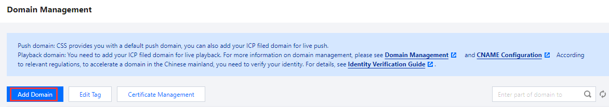
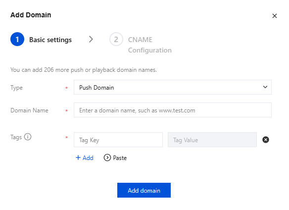
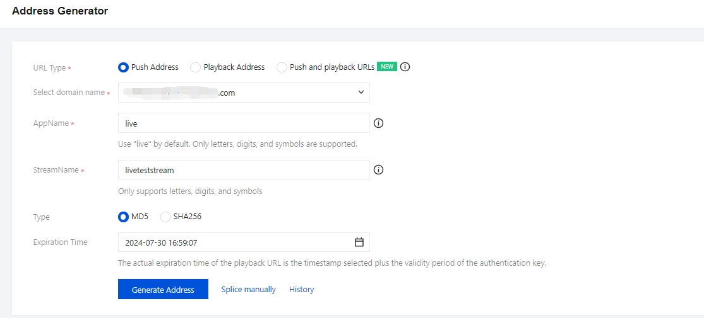
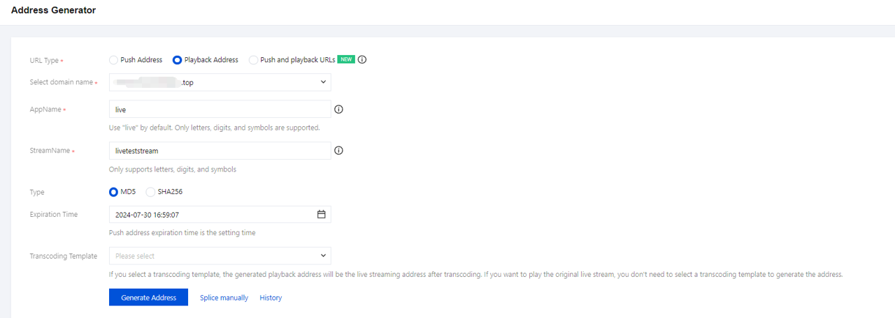
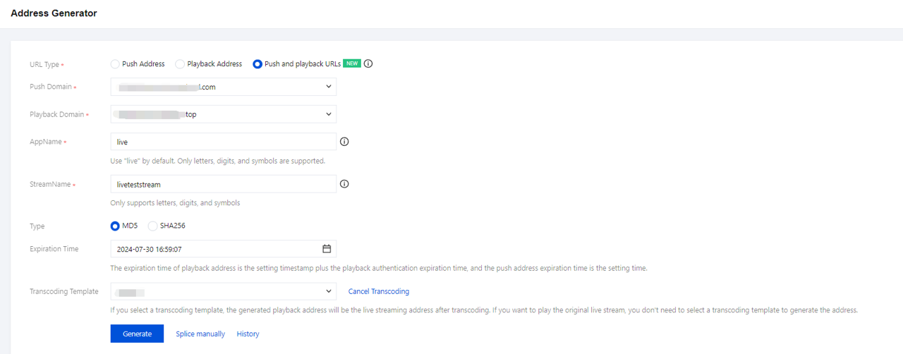

# Getting Started  
**Last updated: 2025-04-10 17:24:47**

This document describes how to get started with CSS. Before trying out CSS, you're advised to read the **Pricing Overview** to understand billable items and prices.

---

## Preparations

- Sign up for a cloud account and complete identity verification.  
- Activate the CSS service in the console.  
- Accept the service terms and submit activation.

---

## Step 1. Add Domain Names

To use CSS, you must configure:

- **One Push domain**
- **One Playback domain**

> A domain name cannot be used for both push and playback.

### Requirements

- Use your own domain name  
- ICP filing is required for domains in Chinese mainland regions  

### Add Domain

1. Go to **Domain Management**
2. Click **Add Domain**

**Tags** can be used to organize resources.

> CSS provides a test domain like `xxxx.livepush.myqcloud.com` for testing only.

---

### Configure CNAME

After adding a domain, the system assigns a **CNAME**. You must configure it in your DNS provider.

Example (if using Tencent DNS):

1. Open Domain Name Service  
2. Click **Resolve**  
3. Add Record  
4. Type: **CNAME**  
5. Value: System-assigned CNAME  
6. Save  

---

## Step 2. Get Push URL

Go to:

**CSS Toolkit → Address Generator**

Configure:

- Domain Type: **Push Domain**
- AppName: `live`
- StreamName: `liveteststream`
- Encryption: MD5 or SHA256
- Expiration Time

Click **Generate Address**

---

## Step 3. Push Live Stream

Use the generated Push URL with:

| Device | Tool |
|-------|------|
| PC | OBS |
| Web | Web Push |
| Mobile | Mobile Demo App |

---

## Step 4. Get Playback URL

Go to:

**CSS Toolkit → Address Generator**

- Domain Type: **Playback Domain**
- StreamName: Same as push
- Choose encryption + expiration

---

## Step 5. Generate Push & Playback Address Group

Use **Address Generator → Push and Playback URLs**

---

## Operations

To enable **live recording**, please create a recording template and bind it to a domain name first. For more information, please see *Creating Recording Template*.

To enable **live transcoding**, please create a transcoding template and bind it to a domain name first. For more information, please see *Creating Transcoding Template*.

To enable **live watermarking**, please create a watermark template and bind it to a domain name first. For more information, please see *Creating Recording Template*.

To enable **live screencapture and porn detection**, please create a screencapture and porn detection template and bind it to a domain name first. For more information, please see *Creating Screencapture and Porn Detection Template*.

To enable **Live Time Shift**, you can create a time shift template and bind it to a domain name. For more information, please see *Creating Time Shift Template*.

To enable **live streaming callbacks**, you can create a callback template and associate it with the domain for configuration. For related documentation, please refer to *Creating a Callback Template*.

To enable **Live Audit**, you can create an audit template and bind it to a domain name. For more information, please see *Creating Audit Template*.

To enable **Live Subtitle**, you can create a subtitle template and bind it to a domain name. For more information, please see *Creating Subtitle Template*.

To enable **live streaming standby content**, you can create a standby content template and associate it with the domain for configuration. For related documentation, please refer to *Creating a Standby Content Template*.

To enable **live stream mixing**, please call the stream mixing API `CreateCommonMixStream`.

To enable **Live Adaptive Bitrate**, you can create an adaptive bitrate template and bind it to a domain name. For more information, please see *Creating Adaptive Bitrate Template*.

---

## FAQs

- Differences between push, live streaming, and VOD  
- Supported push protocols  
- Supported playback protocols  
- Playback URL structure  
- Splicing multiple stream URLs  
