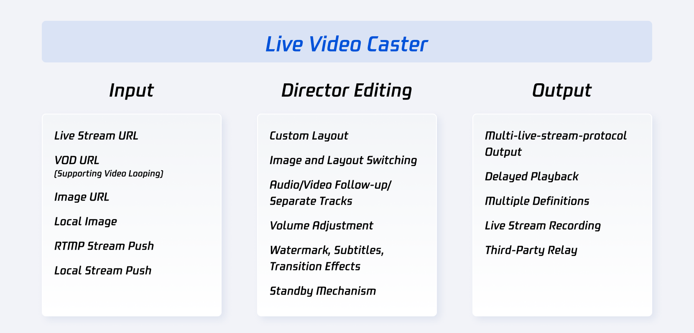

# Live Video Caster (LVC) Overview

**Last Updated:** 2025-04-25

The Cloud Streaming Services console provides the **Live Video Caster (LVC)** service. This guide introduces the system architecture, core capabilities, and application scenarios of LVC.

---

## 1. Product Architecture

LVC acts as a cloud-based live production and distribution system that ingests multiple sources, performs real-time editing, and distributes streams across various protocols and platforms.

### Architecture Layers

| Layer | Capabilities |
|------|-------------|
| **Input** | Live stream URLs, VOD files, images, RTMP push, local streams |
| **Director Editing** | Layout switching, audio follow-up, separate tracks, watermarking, subtitles, transition effects, standby switching |
| **Output** | Multi-protocol streaming, delayed playback, multi-definition output, recording, third-party relay |

---

## 2. LVC Feature Matrix

### 2.1 Input Capabilities (Up to 24 Inputs)

| Type | Feature | Description |
|------|--------|------------|
| **Live Stream Pull** | Pull from stream URL | Supports **RTMP**, **HLS**, and **HTTP-FLV** protocols |
|  | Encoding | Video: H.264 only · Audio: AAC |
| **Live Push** | RTMP Push | Push media files to LVC via RTMP |
| **VOD URL** | Media playback | Supports MP4, HLS, FLV (FLV recommended) |
| **Image Sources** | Image URL / Local Upload | JPG, PNG, BMP supported (≤1920×1080) |
| **Local Stream Push** | Camera / Screen Sharing | Supports 1920×1080, 1280×720, 640×480, 640×360 |

---

### 2.2 Output as Live Stream

| Feature | Description |
|--------|-------------|
| **Dynamic Overlays** | Add ads, scoreboards, graphics, text overlays |
| **Protocol Output** | Supports RTMP, HLS, HTTP-FLV output |
| **Relay** | Push streams to third-party platforms using RTMP |
| **Recording** | MP4, HLS, FLV recording supported |

---

### 2.3 Audio & Video Processing

| Feature | Description |
|--------|-------------|
| **Video Layout** | Combine multiple inputs into custom layouts |
| **Watermark & Text** | Adjustable watermark position and dynamic text overlays |
| **Standby Content** | Automatic switch to standby media if main source fails |
| **Audio Processing** | Per-stream volume adjustment and audio/video separation |

---

### 2.4 Director Processing

| Feature | Description |
|--------|-------------|
| **Pre-monitor & Main Monitor** | Switch preview to main output seamlessly |
| **Delayed Playback** | Supports delay of up to 300 seconds |

---

## 3. Application Scenarios

LVC is widely used in:

- Gaming and e-sports  
- E-commerce live streaming  
- Online education  
- Live events  

👉 **[Application Scenarios]** *(future link)*

---

## 4. Product Strengths

LVC offers scalable, cloud-based live production with:

- Multi-source mixing  
- Backup mechanisms  
- Stream editing  
- Cloud recording  
- Cost-effective live production

👉 **[Product Features]** *(future link)*

---

## 5. Key Takeaways

- LVC functions as a **cloud live production studio**
- Supports multi-source ingestion and professional live editing
- Outputs across multiple streaming protocols
- Suitable for large-scale and professional broadcast scenarios

---