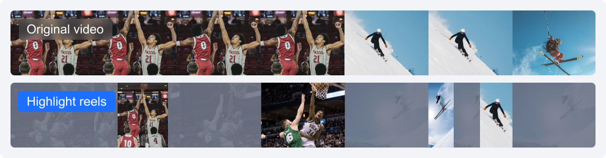

# Features

_Last updated: 2025-12-03 10:11_

MPS transcodes audio/video files to different bitrates and resolutions for smooth playback on various devices with different bandwidth options. It has the following features:

## Audio/Video Transcoding

Transcoding is an offline task that changes the codec, resolution, bitrate, and other characteristics of an audio/video stream to suit different playback devices and network conditions. The benefits of transcoding include:

| Feature                         | Description |
|--------------------------------|-------------|
| Increased compatibility        | A source video can be transcoded to formats (such as MP4) that are compatible with more types of devices for smooth playback. |
| Increased bandwidth adaptability | A source video can be transcoded for output in multiple definitions such as LD, SD, HD, and UHD. End users can select the most appropriate bitrate depending on their network conditions. |
| Improved playback efficiency   | The moov atom can be moved from the end of an MP4 file to the beginning of the file, allowing the video to be played before it is entirely downloaded. |
| Reduced bandwidth consumption  | With a more advanced codec (such as H.265), the bitrate of a video can be substantially reduced while retaining the original quality, which helps reduce the bandwidth consumption. |

The parameters you can specify for transcoding include codec, resolution, bitrate, etc. For details, see the table below.

| Category   | Parameter            | Description |
|-----------|---------------------|-------------|
| **Input** | Container format    | 3GP, AVI, FLV, MP4, M3U8, MPG, ASF, WMV, MKV, MOV, TS, WebM, MXF. |
|           | Video codec         | AV1, AVS2, H.264/AVC, H.264 intra, H.263, H.263+, H.265/HEVC, MV-HEVC, H.266/VVC, MPEG-1, MPEG-2, MPEG-4, MJPEG, VP8, VP9, RealVideo, Windows Media Video, WMV2, Quicktime. |
|           | Audio codec         | AAC, ADPCM, AMR, DSD, MP1, MP2, MP3, PCM, RealAudio, Windows Media Audio, VORBIS, AC-3。 |
| **Output**| Container format    | Video: FLV, MP4, HLS (M3U8 + TS), MXF. Audio: MP3, MP4, OGG, FLAC, M4A, PCM。 Image: GIF, WebP. |
|           | Video codec         | AV1, H.264/AVC, H.264 intra, H.265/HEVC, MV-HEVC, H.266/VVC, MPEG-2, MPEG-4, MJPEG, VP8, VP9, RealVideo, Windows Media Video, WMV2. |
|           | Audio codec         | MP3, AAC, FLAC, MP2, Vorbis. |
| **Packaging** | Delete video streams | If this is enabled, the transcoding result will contain only audio streams. |
|           | Delete audio streams | If this is enabled, the transcoding result will contain only video streams. |   

 
 

## Audio/Video Enhancement

Leveraging the industry-leading AI processing models within MPS, alongside a plethora of applications in various business scenarios, the enhancement feature significantly elevates audio and video quality. It finds extensive application across OTT, e-commerce, and sporting events, delivering substantial business benefits through improvements in Quality of Experience (QoE) and Quality of Service (QoS).

| Enhancement Type  | Features                | Description |
|------------------|------------------------|-------------|
| **Video Enhancement** | Super Resolution | Super-resolution can identify the content and contours of the video, reconstruct the details and local features of the video in high definition, converting low-resolution videos into high-resolution ones, suitable for scenarios like old film restoration. |
|                  | Low-light Enhancement | Due to environmental conditions and limitations of the camera hardware, some scenes may suffer from a lack of brightness and contrast, resulting in dark images or missing details. Activating low light enhancement significantly improves the details and contrast in dark areas, enhancing the subjective quality of the human eye. |
|                  | HDR | Supports HDR10, and HLG, offering a wider color gamut and more color details, providing higher-quality video content. |
|                  | Comprehensive Enhancement | Through AI's comprehensive analytical capabilities, it automatically balances the texture content in the image, enhancing key details while removing compression artifacts and jagged edges, thereby improving the overall subjective perception of the image. |
|                  | Color Enhancement | Color enhancement makes the image closer to real colors and enhances them to some extent to meet the preferences of the human eye. |
|                  | Detail Enhancement | Detail enhancement focuses on the details in the video that require attention (e.g., the grass on a sports field), making the image content clearer and richer. |
|                  | Face Enhancement | Enhance the areas of the video that the human visual system particularly focuses on, such as faces, making the details in these areas clearer and improving subjective perception. |
|                  | Scratches Removal | Scratch removal can repair scratches and snowflake spots in the video, restoring damaged content. |
|                  | Artifacts Removal | Due to multiple compressions of the video during transcoding or multiple transcoding processes, block effects, ringing effects, chroma bleeding, and mosquito noise are introduced, causing distortions that affect the visual effect. De-compression distortion effectively repairs distortions introduced by encoding. |
|                  | Video Noise Reduction | Random noise may be introduced during film shooting due to the camera and environment. This service offers denoising, eliminating random noise in the image without losing detail. |
| **Audio Enhancement** | Audio Noise Reduction | Removes device noise, environmental noise, etc., suitable for scenarios such as recording classes and post-production of outdoor shooting. |
|                  | Audio Separation | Separates human voices from background sounds, or singing voices from accompaniment in audio-video files, creating independent audio materials for post-production artistic processing. |
|                  | Volume Equalization | 1. Loudness Normalization: Maintains a consistent overall loudness level, making the playback sound similar in volume, avoiding issues of being too loud or too quiet, and providing a better auditory experience. 2. Volume Leveling: Smoothens overly loud audio segments, avoiding sudden volume changes, and providing a more stable auditory experience. |
|                  | Audio Improvement | 1. Noise removal: Reduces unwanted noise or interference in the audio, improving the quality and clarity of the audio. 2. De-essing (Sibilance Suppression): Sibilance refers to the sharp, piercing sounds in audio, often produced when the sound source is close to the microphone. Suppressing sibilance aims to reduce or eliminate this unnatural sound, thereby improving audio quality. |

 
 

## Watermarking
Watermarking is an offline task that adds an image at the specified position of the video during video transcoding or screencapturing. MPS supports the following types of watermarks:
- **Static watermark:** Non-animated watermark in PNG format, which can be the logo of a copyright owner or TV station, and is usually used as a copyright claim.
- **Animated watermark:** Animated watermark in APNG format

MPS allows you to add multiple watermarks to a video or screenshot and specify the size and position of each watermark in the video or screenshot.  
The parameters you can specify for watermarking include watermark type, aspect ratio, position, etc. For details, see the table below.

| Parameter    | Description |
|-------------|-------------|
| Type        | The watermark type. Watermarks can be static or animated. |
| Position    | The relative position of a watermark in the video. |
| ImageSize   | The size of the watermark in the video. |
| ImageContent | Binary data of a watermark. |

 
 

## Video Screencapturing

Screencapturing is an offline task that captures a screenshot of a video at a certain point in time. MPS provides the following types of screenshots:

- **Time point screenshot:** Screenshots taken at specified time points
- **Sampled screenshot:** Screenshots taken at regular intervals
- **Image sprite:** MPS can capture a set of screenshots of a video (subimages) at the specified time interval and splice them together to generate a large image.

The parameters you can specify for screenshot taking include screenshot format, aspect ratio, etc. For details, see the table below.

---

### Time point screenshots

| Parameter | Description |
|----------|-------------|
| Format | The screenshot format (only JPG is supported currently) |
| Width | Screenshot width (px). Value range: 128–4096 |
| Height | Screenshot height (px). Value range: 128–4096 |
| FillType | The fill mode (`FillType`) specifies how the source video image processed when the aspect ratio does not match the specified aspect ratio of a screenshot. The following fill modes are supported: • **Scale to fill:** Source video images are stretched to match the aspect ratio of screenshots. This may cause images to appear distorted. • **Black bars:** The aspect ratio of source video images is retained, and the empty spaces are painted black. • **White bars:** The aspect ratio of source video images is retained, and the empty spaces are painted white. • **Gaussian blur:** The aspect ratio of source video images is retained, and Gaussian blur is applied to the empty spaces. |

---

### Sampled screenshots

| Parameter | Description |
|----------|-------------|
| Format | The screenshot format (only JPG is supported currently) |
| Width | Screenshot width (px). Value range: 128–4096 |
| Height | Screenshot height (px). Value range: 128–4096 |
| SampleType | How sampling intervals are measured. Sampling intervals can be measured in two ways: • **By percent:** Intervals are measured by percent. For example, if `Interval` is set to 5 (%), 20 screenshots will be generated for a video. • **By time:** Intervals are measured by time. For example, if `Interval` is set to 10 (sec), the number of screenshots generated will depend on the video length. |
| Interval | The sampling interval. • If the interval measurement (`SampleType`) is by percent, this parameter is a percent value. • If interval measurement is by time, this parameter is a time value (sec). |
| FillType | The fill mode (`FillType`) specifies how the source video image processed when the aspect ratio does not match the specified aspect ratio of a screenshot. The following fill modes are supported: • **Scale to fill:** Source video images are stretched to match the aspect ratio of screenshots. This may cause images to appear distorted. • **Black bars:** The aspect ratio of source video images is retained, and the empty spaces are painted black. • **White bars:** The aspect ratio of source video images is retained, and the empty spaces are painted white. • **Gaussian blur:** The aspect ratio of source video images is retained, and Gaussian blur is applied to the empty spaces. |

---

### Image sprites

| Parameter | Description |
|----------|-------------|
| Format | The format of the image sprite (only JPG is supported currently). |
| Width | The width of the subimage in an image sprite. |
| Height | The height of the subimage in an image sprite. |
| Rows | The number of image rows in a sprite. |
| Columns | The number of image columns in a sprite. |
| SampleType | How sampling intervals are measured. Currently, only sampling by time is supported. |
| Interval | The time interval for image sampling. |

> **Note:**  
> • The result of multiplying **Width × Columns** (i.e., sprite width) should be within the range of 128–4096.  
> • The result of multiplying **Height × Rows** (i.e., sprite height) should be within the range of 128–4096.

---

### Animated screenshots

Animated screenshot generating is an offline task that converts a video segment to an animated screenshot such as in GIF or WebP format. An animated screenshot is a seamless cycle of continuous frames, which can deliver an animation effect with a small file size.  
The parameters you can set for animated image generation include format, width, height, frame rate, etc. For details, see the table below.

| Parameter | Description |
|----------|-------------|
| Format | The format of the animated image (only GIF and WebP are supported currently). |
| Width | The animated image width. Value range: 128–4096 px. |
| Height | The animated screenshot height. Value range: 128–4096 px. |
| FPS | The frame rate. Value range: 1–60 fps. |

 
 

## Smart Captions and Subtitles

The Smart Captions and Subtitles feature recognizes voices from videos or live streams in real-time, converts speech to subtitles, and translates them into various languages like Chinese, English, and Japanese-Korean. It's useful for live subtitles, video transcription for global distribution, and extracting subtitles from old films for restoration. The feature supports configuring HotWord for more accurate translations. For more information, see (tutorial _(will be added soon)_ `Subtitle Generation and Translation`).

### Technical Advantages

- **Comprehensive Platform Support:** Capable of processing on-demand files, live streams, and interactive audio-video. Live broadcast real-time simultaneous subtitles support steady and gradient modes, with a low barrier to entry and no need for modifications on the playback end.

- **High Accuracy:** Utilizes large-scale models and supports hotword and terminology libraries, leading the industry in accuracy.

- **Rich Language Support:** Offers support for hundreds of languages, including various dialects and mixed-language recognition, such as combinations of Chinese and English.

- **Customizable Styles:** Allows for embedding subtitles directly into videos, with customizable subtitle styles (font, size, color, background, position, etc.) and supports custom page rendering.

### Smart Erase

Smart Erase is capable of blurring, pixelating, or seamlessly removing elements such as subtitles, faces, and license plates from video footage, thereby facilitating the dissemination and sharing of content. This feature is extensively utilized across various domains including short drama platforms, short video platforms, cross-border e-commerce, and self-media studios, among others. For more information, please visit `Smart Erase Tutorial`_(will be added soon)_.

- **High Customizability:** Offers the ability to tailor model parameters specifically for your video scenarios, enhancing the accuracy and effectiveness of the erasure process, and ensuring that the final visuals are presented more naturally and fluidly.

### Intelligent Highlights

Intelligent Highlights identify key scenes in videos, like protagonist conflicts or thrilling fights, by aligning image and text features. This enables the extraction of engaging segments from various video types such as movies, sports, and games, with customization options. For more details, visit `Intelligent Highlights Tutorial`_(will be added soon)_.

#### Technological Advantages

Supports both on-demand and live content, creating highlights from past broadcasts.
Works with movies, sports, games, and news.
Highly customizable for specific video scenarios.

> **Note:** 
>   _Other services of `Media AI` documentation will be added soon!_

 
 

## Live Stream Recording

By entering the live streaming address, you can easily and quickly record live content. It supports presetting recording cycles and individual TS durations to enable continuous recording.

| Parameter               | Parameter Description                                                                           |
|-------------------------|-------------------------------------------------------------------------------------------------|
| Single TS duration      | Single TS duration supports 5-30 seconds.                                                       |
| Recording cycle         | Range: 10-720 minutes. After the set recording period is exceeded, a new file will be generated. |
| Resuming timeout duration | Range: 60-1800 seconds. The resuming timeout duration will directly affect the generation time of the recording file. |

---

### Terminal SDK

The Terminal SDK is a product capability launched by Freedom Cloud for audio and video terminals, including three types of feature SDKs: video encoding, audio enhancement, and video enhancement. It provides targeted product capabilities to meet the needs of different customer scenarios. The Terminal SDK product works on customer terminal devices and supports multi-terminal access such as mobile, Web, and PC. For specific operations, see `Terminal SDK Connection Guide` _(will be added soon)_ .

| Terminal SDK Type        | Feature Description |
|--------------------------|---------------------|
| Terminal Video Codec SDK | Freedom Top Speed Codec terminal video encoder is an encoder developed for device-side scenarios with low computing power, low latency, and high-quality images. Compared to hardware encoding, its advantages are: • Stable, reliable, and fast startup. • Saves bitrates while maintaining the same video quality, improves the stability of transmission, reduces downlink distribution bandwidth, and saves storage costs. • Improves video quality at the same bitrates, enhancing user experience. • Has rich features to meet diverse business needs, such as using ROI encoding to improve the quality of the face area and dynamically adjusting encoding configurations to adapt to network fluctuations. |
| Terminal Audio SDK       | The Terminal Audio SDK includes the Standard Edition, Professional Edition, and Ultimate Edition, supporting the following features: • Acoustic echo cancellation. • Automatic gain control. • Adaptive noise suppression. • Echo cancellation music mode. • Volume equalization. • AI intelligent noise reduction. • Audio encoding. • AI Codec. |
| Terminal Enhancement SDK. | The client enhancement SDK, based on efficient image process algorithms and AI model-based reasoning capabilities, realizes terminal video super-resolution, image quality enhancement, frame interpolation, and other features, including the Standard Edition, Professional Edition, and Ultimate Edition, and supports the following features: • Standard super-resolution/Professional super-resolution/Standard super-resolution with enhancement parameters. • AI image quality enhancement. • AI frame interpolation enhancement. |
