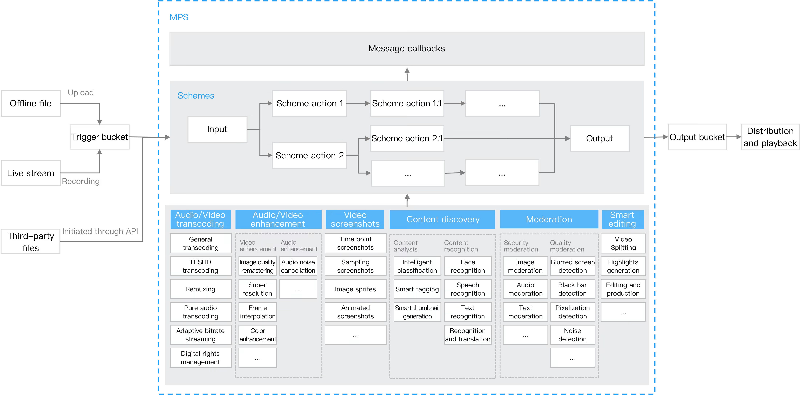

# Media Processing Service (MPS)

_Last updated: 2025-12-03 12:49_

MPS is a cloud-based audio/video processing service. Built on Tencent's many years of experience in audio/video technologies, it provides ultimate encoding capabilities that enable you to play back audio/video files on various platforms at greatly reduced storage and bandwidth costs. 

It provides a rich set of features including video screencapturing, audio/video enhancement, content discovery, and content moderation, satisfying your video processing needs in a range of different scenarios.

---

## Table of Contents

- [Getting started](quickstart.md) *(в разработке)*

- **Step-by-step guides**
  - [Transcoding tasks](operations/transcoding.md)*(в разработке)*
  - [Video enhancement](operations/enhancement.md)*(в разработке)*
  - [Watermarking](operations/watermarking.md)*(в разработке)*
  - [Video screencapturing](operations/screencapturing.md)*(в разработке)*
  - [Live stream recording](operations/live-recording.md)*(в разработке)*
  - [Terminal SDK](operations/terminal-sdk.md)*(в разработке)*

- **Concepts**
  - [Product overview](#overview)
  - [Features](concepts/features.md)
  - [Strengths](concepts/strengths.md)
  - [Use cases](concepts/use-cases.md)

- **Media AI capabilities**
  - [Smart captions and subtitles](operations/media-ai.md) *(в разработке)*
  - [Intelligent highlights](operations/media-ai.md) *(в разработке)*
  - [LLM summarize](operations/media-ai.md) *(в разработке)*
  - [ROI intelligent recognition](operations/media-ai.md) *(в разработке)*
  - [Content auditing](operations/analysis.md) *(в разработке)*
  - [Quality evaluation](operations/evaluation.md) *(в разработке)*

- **API / CLI / Terraform**
  - [`api-ref`](api-ref/) *(в разработке)*
  - [`cli-ref`](cli-ref/) *(в разработке)*
  - [`terraform-ref`](terraform-ref/) *(в разработке)*

- Quotas & limits *(в разработке)*
- Access management *(в разработке)*
- Pricing *(в разработке)*
- Tutorials *(в разработке)*
- FAQ *(в разработке)*

---

## Overview

### Product Architecture

You can upload source video files to a COS bucket through the console, SDKs, or APIs. You can use the scheme mechanism of MPS to trigger the automatic execution of video processing tasks and send event notifications to CMQ. This helps you stay informed of the status of transcoding tasks. The architecture of MPS is shown below:

MPS transcodes audio/video files to different bitrates and resolutions for smooth playback on various devices with different bandwidth options.

It supports multiple processing capabilities, including:

- Audio/video transcoding  
- Audio/video enhancement  
- Video screencapturing  
- Content discovery  
- Content moderation  
- Smart editing  

---

