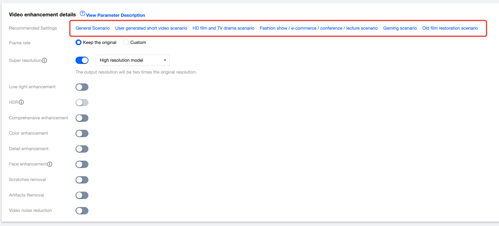

# Image Quality Improvement Scenario

Last updated **：** 2025-03-21 15:24:37

### Overview

Tencent Cloud Media Processing enhances video quality in on-demand and live streaming, boosting user retention and commercial conversion. It offers technical solutions across gaming, talent shows, education, and film, adapting to different content needs with its technical expertise and industry experience.

---

## Key Requirements

- Enhance video quality by rectifying visual imperfections, thereby presenting a superior viewing experience.
- Enable intelligent on-demand processing to reduce costs and increase efficiency.

---

## Our Solutions

### Abundant Audio and Video Enhancement Capabilities

Media Processing provides various audio and video enhancement options.  
Users can apply single or multiple features for better results.

---

## Enhancement Capabilities

### Video Enhancement

| Enhancement Type | Feature | Description |
|---|---|---|
| Video Enhancement | Super Resolution | Identifies video content and contours, reconstructs details and local features in high definition, converting low-resolution videos into high-resolution ones. Suitable for scenarios such as old film restoration. |
| Video Enhancement | Low-light Enhancement | Improves brightness and contrast in dark scenes caused by environmental conditions or camera limitations, enhancing subjective visual quality. |
| Video Enhancement | HDR | Supports HDR10 and HLG, offering a wider color gamut and richer color details for higher-quality video content. |
| Video Enhancement | Comprehensive Enhancement | Automatically balances texture content using AI, enhances key details, and removes compression artifacts and jagged edges to improve overall visual perception. |
| Video Enhancement | Color Enhancement | Adjusts colors to be closer to real tones and enhances them to match human visual preferences. |
| Video Enhancement | Detail Enhancement | Enhances fine details in videos (e.g., grass on sports fields), making content clearer and richer. |
| Video Enhancement | Face Enhancement | Enhances regions of interest such as faces, improving clarity and subjective perception. |
| Video Enhancement | Scratches Removal | Repairs scratches and snowflake artifacts, restoring damaged video content. |
| Video Enhancement | Artifacts Removal | Removes block effects, ringing, chroma bleeding, and mosquito noise caused by multiple compressions during transcoding. |
| Video Enhancement | Video Noise Reduction | Eliminates random noise introduced during filming without losing image details. |

---

### Audio Enhancement

| Enhancement Type | Feature | Description |
|---|---|---|
| Audio Enhancement | Audio Noise Reduction | Removes device and environmental noise, suitable for class recordings and outdoor post-production. |
| Audio Enhancement | Audio Separation | Separates human voice from background sound or vocals from accompaniment, enabling post-production processing. |
| Audio Enhancement | Volume Equalization | **Loudness Normalization:** Maintains consistent overall loudness. **Volume Leveling:** Smooths overly loud segments and avoids sudden volume changes. |
| Audio Enhancement | Audio Improvement | **Noise Removal:** Reduces unwanted audio noise. **De-essing:** Suppresses sharp sibilant sounds caused by close microphone recording. |

Refer to the figure below:

The Media Processing Console lets you create and manage audio and video enhancement templates with pre-configured and customizable parameters for various scenarios, helping you quickly meet your business needs.

---

## On-Demand Processing Solutions

Audio and video services provide enhancement and on-demand **Quality Inspection + Transcoding & Enhancement**.  
This approach enables cost optimization by inspecting video quality before enhancement. Based on inspection results, an appropriate enhancement template is selected. Improvements are measured by comparing video quality scores before and after processing.

---

### Features

| Feature | Description | How to use |
|---|---|---|
| Quality Inspection | **Quality Inspection includes:**  • **Format quality inspection:** Detects format issues such as DTS, PTS problems, resolution changes, sampling rate changes, frame loss, and duplicate frames.  • **Image quality inspection:** Supports detection of video image quality issues, including *JitterResults, BlurResults, AbnormalLightingResults, CrashScreenResults, BlackWhiteEdgeResults, NoiseResults, MosaicResults*, etc.  • **No-Reference quality assessment** | Refer to the **Media Quality Inspection Integration** documentation. |
| Audio and Video Enhancement | In on-demand processing scenarios, the focus is on fixing audio and video issues identified during quality checks through targeted interventions:  • Low-light Enhancement • Comprehensive Enhancement • Face Enhancement • Audio Noise Reduction  Videos without detected issues do not require enhancement, which helps reduce costs. | Refer to the **ProcessMedia** documentation. |
