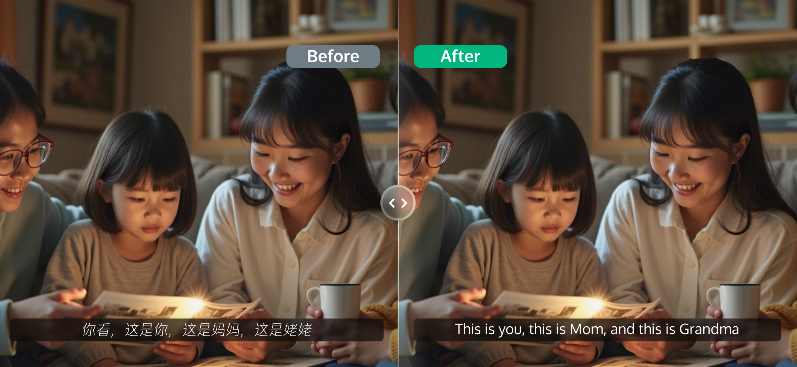
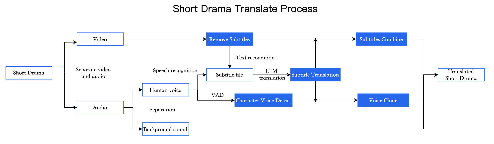

# Short Drama Translation Scenario

Last updated **：** 2025-03-21 15:25:

### Overview

Tencent Cloud's media processing products provide solutions for short dramas' global expansion, aiming

to help creators and producers introduce them to international markets. This document introduces the

functionalities and usage methods to achieve internationalization and localization of short dramas quickly.



```
Left: Original video with CN text and Chinese voice; Right: Generated multilingual subtitles and speech after processing;
Note: Image generated by Tencent Yuanbao AI
```
### Requirements for Short Drama Clients

The challenges faced in the promotion of a vast array of videos include inefficient manual processing, the necessity to automatically recognize and generate multilingual subtitles, the erasure or replacement of items within the video, as well as substituting the original language dialogue with the target market language and re-dubbing to enhance the viewing experience.

### Our Solutions

Short dramas seeking international exposure urgently require solutions for subtitle translation, dubbing conversion, and multilingual translation. We offer a comprehensive one-stop solution for the translation and production of short dramas.




| Feature | Description |
|---|---|
| One-Stop Short Drama Translation and Production (Subtitle Removal + Voiceover & Translation + Audio Synthesis & Replacement) | This feature offers a comprehensive solution for original subtitle erasure, subtitle & voice translation, and multilingual subtitle & voice replacement. Utilizing this capability, the input video will be processed in the following sequential steps:  <br><br>1. Identify the subtitles within the original video’s visuals, followed by their erasure.  <br>2. Recognize the original video’s audio to generate subtitle files, which are then translated. The translated subtitles are subsequently:  <br>&nbsp;&nbsp;2.1. Rendered onto the original video’s subtitle positions.  <br>&nbsp;&nbsp;2.2. Used to replace the original video’s soundtrack through voice synthesis.  <br>3. Synthesize a new video.  <br><br>**Example**  <br><br>  <br><br>Left chart: Original Chinese short video; Right chart: The processed output video has English subtitles and English dubbing. |


Distinct capabilities can also be integrated independently, as detailed below:

| Feature | Description |
|---|---|
| Erasure of watermarks, logos, subtitles | Remove watermarks, logos, subtitles, and other elements from videos, including blurring and seamless removal options. Supports erasing many common watermarks and offers custom training for others at an additional cost. |
| Facial and License Plate Sensitive Information Blurring / Mosaic | Apply blurring or mosaic effects to sensitive information such as faces and license plates within video frames. |
| Human voice and background sound separation | Separation of human voice and background sound. |
| Text recognition | Recognizes text in a video, including vertically oriented text, and automatically extracts keywords from the text. |
| Speech recognition | Quickly recognizes the speech in a video and converts it to text based on deep learning. You can specify custom keywords and locate the time points in the video at which the keywords are spoken. |
| Subtitle Translation | Translate original subtitles to generate multilingual subtitles, catering to the needs of audiences from diverse linguistic backgrounds. Supports the configuration of a terminology database to enhance translation accuracy. |
| Incorporating Subtitles into Videos | Automatically generated subtitle files are embedded into videos through transcoding, allowing for customization of style, font, size, color, and background color. |
| Text-to-Speech Conversion | Extract subtitle files to create new multilingual audio files. |
| Replace the original video's audio track | Replace the original video audio with generated multilingual audio to enhance the viewing experience for local audiences. |
| Digital Rights Management (DRM) | For copyrighted content, support for commercial DRM and HLS private encryption. Supported DRM formats include FairPlay and Widevine. |

