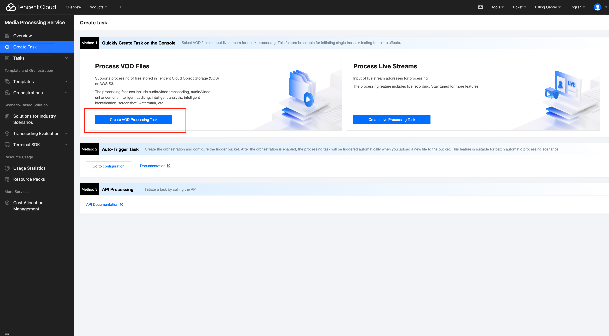
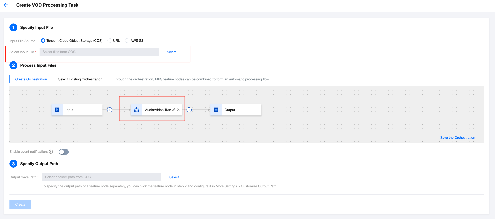
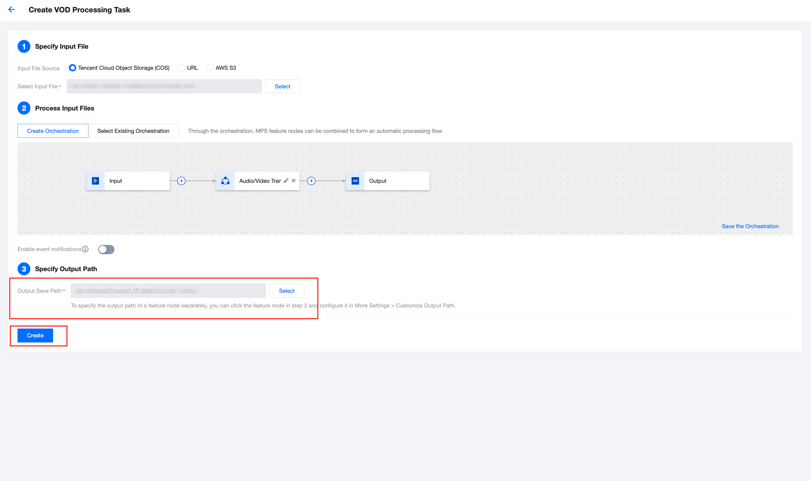
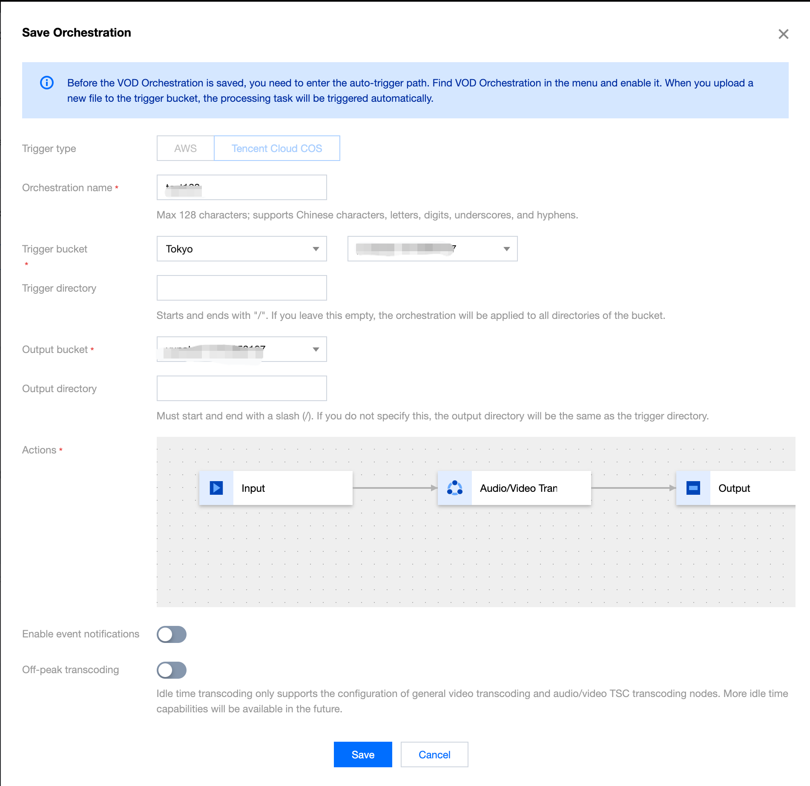
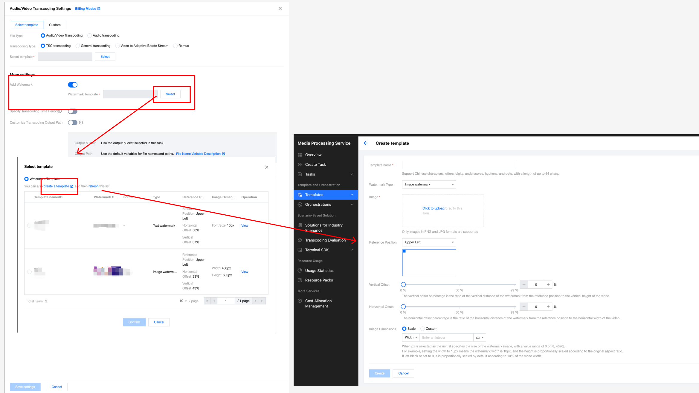
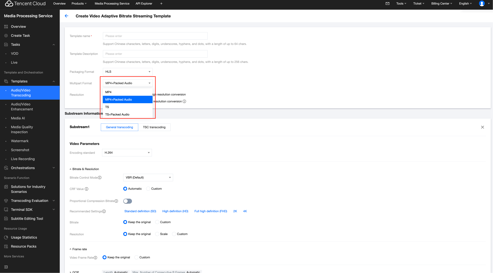
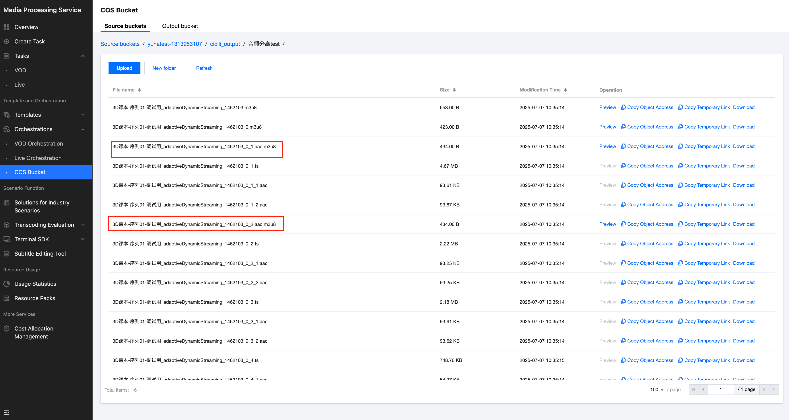

**Last updated:** 2025-11-17 16:27:47

---

## I. Audio / Video Transcoding Feature Overview

### Overview

Audio/video transcoding is the process of converting the original audio/video bitrate stream into another audio/video bitrate stream.  
It is an **offline task**.

Through transcoding, parameters such as the **encoding format**, **resolution**, and **bitrate** of the original bitrate stream can be changed to adapt playback on different terminals and in different network environments.

For an explanation of various types of transcoding, see the table below.

---

## Transcoding Types

| Applicable Input Source | Transcoding Type | Description |
|---|---|---|
| Video | Standard video transcoding | Reduces video bitrate and changes parameters such as encoding standard, resolution, and frame rate to adapt playback on different terminals and in different network environments. |
| Video | TSC transcoding | Top Speed Codec (TSC) transcoding is an upgraded feature of standard video transcoding. It performs adaptive optimization on different types of videos, delivering higher-definition viewing experiences with lower bandwidth consumption. While maintaining or enhancing image quality, it reduces bandwidth costs by more than 50%. |
| Video | Adaptive bitrate stream for videos | Converts the input video file into multiple bitrate streams suitable for playback in different scenarios, allowing users to select a suitable bitrate based on network conditions and enhancing user experience. |
| Video | Remux | Changes the encapsulation format of the source video file without re-encoding. |
| Audio | Standard audio transcoding | Reduces audio bitrate and changes parameters such as encoding standard, sampling rate, and sound channel to adapt playback on different terminals and in different network environments. |
| Audio | TSC transcoding for audio | An upgraded feature of standard audio transcoding. Performs adaptive optimization on different types of audio, delivering higher-definition listening experiences with lower bandwidth consumption. |
| Audio | Adaptive bitrate stream for audio | Converts the input audio file into multiple bitrate streams suitable for playback in different scenarios, adapting to different network conditions and enhancing user experience. |

---

## Technical Strengths

Media Processing Service supports comprehensive audio and video encoding standard compression and provides multiple transcoding methods, including:

- TSC transcoding  
- Adaptive bitrate streaming  
- Remux  
- Audio transcoding  

Within the industry, Tencent Cloud MPS supports the most comprehensive audio/video encoding standard compression. It provides multiple transcoding methods such as TSC transcoding, adaptive bitrate stream transcoding, Remux, and audio transcoding. With distributed transcoding supporting up to 30+ times speed, it helps reduce playback bandwidth consumption and costs.

## Comprehensive Encoding Method, Reducing the Bitrate by More Than 50%

Provide comprehensive encoding methods (such as VP8, H.264, VP9, H.265, AV1, AVS3, and H.266), which can significantly reduce the bitrate without quality loss, saving playback bandwidth and storage costs.

---

## Superior Image Quality and Crystal-Clear View

By using intelligent dynamic encoding technology, TSC delivers a superior viewing effect while reducing the bitrate. Compared to open-source encoders, the VMAF score increases by 3 to 5 points. It supports real-time encoding for high-resolution videos up to 8K, integrating advanced technologies such as super-resolution, HDR, and expanded color gamut. Moreover, it was one of the first in China to support Dolby Vision/Dolby Atmos, providing an exceptionally clear viewing experience.


---

> **Note**  
> Open **MPS Demo**, where you can quickly experience the effects of the audio/video transcoding feature.

---

## How to Use the Audio/Video Transcoding Feature

### (1) Precautions Before Use

Before using the audio/video transcoding feature, you need to complete the following preliminary operations: registration/login for a Tencent Cloud account, activation and authorization of the COS service. For a specific operation guide, see **Getting Started**. For account authorization issues, see **Account Authorization**.

---

### (2) Creating Audio/Video Transcoding Tasks

Tencent Cloud MPS provides three task initiation methods: quickly creating tasks through the console, initiating tasks through the API, and automatically triggering tasks. The following flowchart shows the general operation process for each task initiation method. To learn about the specific configuration methods for audio/video transcoding tasks, see the detailed instructions in the **Creating Audio/Video Transcoding Tasks** section below.


---

## II. Creating Audio/Video Transcoding Tasks

### Method 1. Initiating a Zero-Code Task from the Console

1. Go to the **Media Processing Service** console, and then click  
   **Create Task > Create VOD Processing Task**.

   

2. First, specify the input video file. You can select audio/video files from a COS or AWS S3 bucket, or provide a file download URL.

3. Then, in the step "Select Input File", add a Audio/Video Transcoding node.

   

4. In the Audio/Video Enhancement Settings pop-up window, select the required audio/video transcoding template or custom transcoding parameters. For detailed template parameter configuration instructions, see Audio/Video Transcoding Template.


5. Finally, after specifying the output video storage path, click Create to initiate the task.




### Method 2. Initiating a Task via the API

* Method (1): Call the ProcessMedia API to initiate a task by specifying the Template ID. Example:
- **Method (1): Call the ProcessMedia API to initiate a task by specifying the Template ID. Example:**

```json
{
  "InputInfo": {
    "Type": "URL",
    "UrlInputInfo": {
      "Url": "https://test-1234567.cos.ap-guangzhou.myqcloud.com/video/test.mp4"// Replace it with the video URL to be processed.
    }
  },
  "OutputStorage": {
    "Type": "cos",
    "CosOutputStorage": {
      "Bucket": "test-1234567",
      "Region": "ap-guangzhou"
    }
  },
  "MediaProcessTask": {
    "TranscodeTaskSet": [
      {
        "Definition": 100800//100800 is the preset template ID for video transcoding. It can be replaced with your custom audio/video transcoding template ID.
      }
    ]
  }
}
```
* Method (2): Call the ProcessMedia API to initiate a task by specifying the Orchestration ID (for orchestration creation instructions, see the Automatic Trigger section below or see the VOD Orchestration documentation). Example:

```json
{
  "InputInfo": {
    "Type": "COS",
    "CosInputInfo": {
      "Bucket": "test-1234567",
      "Region": "ap-guangzhou",
      "Object": "/video/123.mp4"
    }
  },
  "OutputStorage": {
    "Type": "cos",
    "CosOutputStorage": {
      "Bucket": "test-1234567",
      "Region": "ap-guangzhou"
    }
  },
  "ScheduleId": 12345  //Replace it with a custom orchestration ID. 12345 is a sample code and has no practical significance.
}
```

> It is recommended to use **API Explorer** for quick debugging and verification.  
> Enter the online debugging page of the MPS **API Explorer**, and select the **ProcessMedia** API from the API list on the left.  
> Fill in parameters such as the input path, output path, template ID, and orchestration ID, and then initiate the online API call.
>
>

---

## Appendix: Additional Parameters for Transcoding-Related APIs

Some advanced features are not available for configuration on the **Create a Transcoding Template Through the Console** page.  
You can use the API to **CreateTranscodeTemplate** and pass in additional parameters through **StdExtInfo**.

---

## Supplementing Audio Streams with Silence Packets

| Parameter Name | Requirement | Type | Remarks |
|---|---|---|---|
| enable_mute_audio | Optional | Int | If enabled, silence packets will be supplemented. The default value is `0`.<br><br>• `0`: Do not enable.<br>• `1`: Fill with silence packets when audio frames are discontinuous.<br>• `2`: On the basis of `1`, supplement silence packets for cases where there is no audio at the end. |


Example JSON:
```json
"StdExtInfo" : "{\"audio_info\":{\"enable_mute_audio\":1}}"
```
 ## Transcoding Output File Storage Method

The console supports configuring COS and AWS S3 as output paths. You can also use additional parameters to upload transcoding output files to other third-party cloud storage.

| Parameter Name | Requirement | Type | Remarks |
|---|---|---|---|
| appid | Optional | String | Cloud account ID. |
| bucket | Required | String | Bucket name. |
| region | Required | String | Bucket region name. |
| headers | Optional | JSON structure | JSON structure indicating the headers carried when uploading files. Example:<br><br>`"headers": {`<br>&nbsp;&nbsp;`"agent": "tencent",`<br>&nbsp;&nbsp;`"used": "for-test"`<br>`}` |
| token | Optional | String | Upload and download using the temporary token method. |
| id | Optional | String | User SecretId. |
| key | Optional | String | User SecretKey. |
| host | Optional | String | Host. |
| access_point | Optional | String | `aws_vpc` type is required. |
| storage_type | Optional | String | • `aws_s3`: AWS S3.<br>• `aws_vpc`: AWS private cloud.<br>• `oss`: Alibaba Cloud OSS. |

---

### Example JSON

```json
{
  "StdExtInfo": "{\"cos_info\":{\"storage_type\":\"oss\",\"bucket\":\"test-test\",\"region\":\"cn-shenzhen\",\"id\":\"abcdefghijk\",\"key\":\"lmnopqrstuvwxyZ\"}}"
}
```


---


### Method 3. Automatically Triggering an MPS Task After a File Is Uploaded to COS

If you want to upload a video file to the COS bucket and achieve automatic audio/video transcoding according to preset parameters, you can:

1. Click Save the Orchestration when creating a task, and configure parameters such as the triggered bucket and triggered directory in the pop-up window.


2. Then, go to the VOD Orchestration list, find the new orchestration, and enable the switch at Enable. Subsequently, any video files added to the triggered directory will automatically initiate tasks according to the preset process and parameters of the orchestration, and the processed video files will be saved to the output path configured in the orchestration.

> Note:
> It takes 3-5 minutes for the orchestration to take effect after being enabled.


## III. Querying Task Results

### 1. Task Callback
When initiating an MPS task using ProcessMedia, you can set callback information through the TaskNotifyConfig parameter. After the task processing is completed, the task result will be callback through the configured callback information. You can parse the event notification result through ParseNotification.

### 2. Querying Task Results

#### Method 1: Querying Task Results by Calling the DescribeTaskDetail API:
Enter the `TaskId` returned by ProcessMedia (for example, 24000022-WorkflowTask-b20a8exxxxxxx1tt110253) to query task results.


#### Method 2: Querying Task Results in the Console:
1. Go to the VOD Processing Tasks console, and the task you just initiated will be listed in the task list.


2. When the subtask is in the "Successful" status, you can navigate to COS Bucket > Output Bucket, find your output location, and then preview or download the audio/video transcoding output files.


---


## IV. Instructions for More Transcoding-Related Features


### Watermarking

When creating a transcoding task, you can watermark it.
* When initiating a transcoding task in the console, you can follow the following steps to watermark it:



* When initiating a task using the API, you can see the following example:
```json 
{
  "InputInfo": {
    "Type": "URL",
        "UrlInputInfo": {
            "Url": "https://test-1234567.cos.ap-guangzhou.myqcloud.com/video/test.mp4" // Replace it with the video URL to be processed.
    }
  },
  "OutputStorage": {
    "Type": "cos",
    "CosOutputStorage": {
      "Bucket": "test-1234567",
      "Region": "ap-guangzhou"
    }
  },
  "MediaProcessTask": {
    "TranscodeTaskSet": [
      {
        "Definition": 100800,//100800 is the preset template ID for video transcoding. It can be replaced with your custom audio/video transcoding template ID.
        "WatermarkSet": [
          {
            "Definition": 12345//Replace it with a watermark template ID. 12345 is a sample code and has no practical significance.
          }
        ]
      }
    ]
  }
}
```


# FAQs
## How to Achieve a Higher Compression Rate?
In addition to setting normal encoding parameters such as bitrate and CRF, we recommend using the extreme compression template in TSC (which contains preset templates for various scenarios) to experience higher compression and better image quality.

## How to Improve the Image Quality for Optimal Results?
If there are further requirements for image quality, it is recommended to use the audio/video enhancement feature, which can significantly improve the image quality and has various capabilities such as comprehensive enhancement, face enhancement, artifacts removal, color enhancement, super-resolution, intelligent frame interpolation, and large models. For detailed integration instructions, see Audio/Video Enhancement Integration Tutorial.

## Whether Object Storage of Other Platforms Can Be Configured as the Output File Storage Path for Transcoding?
Yes. The object storage path of other platforms can be configured through the additional parameter StdExtInfo. For details, see the section Appendix: Additional Parameters for Transcoding-Related APIs above.

## Whether External Subtitles Are Supported?
When using an adaptive bitrate stream for videos, you can specify external subtitle files through the AddOnSubtitles field to generate multi-bitrate HLS with subtitles. 
To avoid the risk of character corruption, currently only UTF-8 encoded subtitle files are supported. Accepted formats include: SRT, WebVTT, ASS, and SSA.
Example JSON of ProcessMedia:
```json 
{
  "InputInfo": { //Enter video information.
    "Type": "COS",
    "CosInputInfo": {
      "Bucket": "test-1234567",
      "Region": "ap-guangzhou",
      "Object": "/test/subtitleinput/test.mp4"
    }
  },
  "OutputStorage": { //Output bucket.
    "Type": "COS",
    "CosOutputStorage": {
      "Bucket": "cg-1308104797",
      "Region": "ap-guangzhou"
    }
  },
  "OutputDir": "/yunaMPStest/abroutput/", ////Output path.
  "MediaProcessTask": {
    "AdaptiveDynamicStreamingTaskSet": [ //Adaptive bitrate stream configuration.
      {
        "Definition": 1414064, //Adaptive bitrate stream template ID.
        "AddOnSubtitles": [ //External subtitle configuration.
          {
            "Type": "subtitle-stream",
            "Subtitle": {
              "Type": "COS",
              "CosInputInfo": {
                "Bucket": "test-1234567",
                "Region": "ap-guangzhou",
                "Object": "/test/subtitleinput/chs.srt"
              }
            },
            "SubtitleName": "chs"
          },
          {
            "Type": "subtitle-stream",
            "Subtitle": {
              "Type": "COS",
              "CosInputInfo": {
                "Bucket": "test-1234567",
                "Region": "ap-guangzhou",
                "Object": "/test/subtitleinput/cht.srt"
              }
            },
            "SubtitleName": "cht"
          },
          {
            "Type": "subtitle-stream",
            "Subtitle": {
              "Type": "COS",
              "CosInputInfo": {
                "Bucket": "test-1234567",
                "Region": "ap-guangzhou",
                "Object": "/test/subtitleinput/eng.srt"
              }
            },
            "SubtitleName": "eng"
          }
        ]
      }
    ]
  }
}
```
## Multi-Track Input Video: How to Generate Separate Streams in HLS for Playback Switching

### Scenario:
When the source video contains multiple audio tracks (such as bilingual dubbing) or video tracks (e.g., an ABR HLS stream), you can do adaptive bitrate streaming with the following configuration to enable seamless switching between different audio or video tracks during playback.

### Solution: 
When creating a Video Adaptive Bitrate Streaming Template and selecting HLS as the output format, enable the "TS + Packed Audio" or "MP4 + Packed Audio" mode under the Multipart Format configuration. This will output video files (TS or MP4) alongside standalone raw audio files, allowing you to switch between different audio tracks during playback.






## What is accelerated transcoding? Does the service support it? 
Accelerated transcoding significantly speeds up video processing times by splitting the video into segments for parallel encoding. This feature is particularly effective for handling medium to long videos. The Media Processing service supports accelerated transcoding, achieving speed-ups of over 30 times. To enable this feature, please contact us for activation.
## Billing Overview
Tencent Cloud Media Processing (MPS) audio/video transcoding service adopts a billing model based on output file duration. It supports multiple processing types such as standard transcoding, Remux, TSC transcoding, audio-only transcoding, and off-peak transcoding. For the complete explanation of various types of billing rules, see [Audio/Video Transcoding Billing](../../pricing.md).