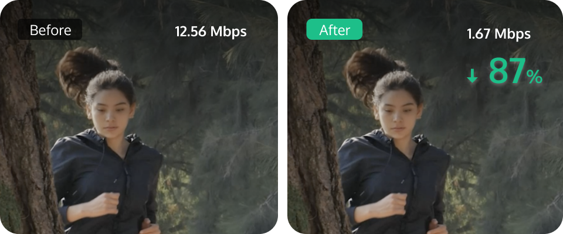
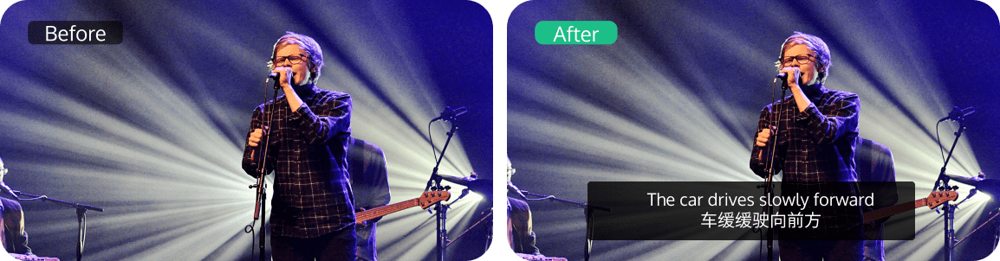
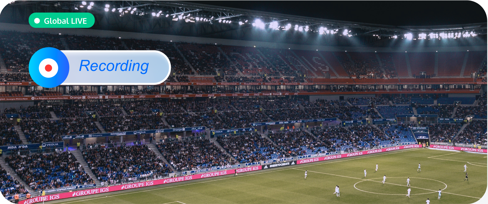

# Функциональные возможности

_Последнее обновление: 2025-12-03 10:11_

MPS выполняет транскодирование аудио- и видеофайлов в различные битрейты и разрешения, обеспечивая плавное воспроизведение на различных устройствах при разных условиях пропускной способности сети. Сервис предоставляет следующие возможности:

## Аудио/видео транскодирование

Транскодирование — это офлайн-задача, при которой изменяются кодек, разрешение, битрейт и другие характеристики аудио- или видеопотока для адаптации под различные устройства воспроизведения и сетевые условия. Основные преимущества транскодирования:

| Возможность | Описание |
|------------|----------|
| Повышенная совместимость | Исходное видео может быть транскодировано в форматы (например, MP4), совместимые с большим количеством устройств для плавного воспроизведения. |
| Лучшая адаптация к пропускной способности | Исходное видео может быть транскодировано в нескольких качествах (LD, SD, HD, UHD). Пользователи могут выбрать оптимальный битрейт в зависимости от условий сети. |
| Повышенная эффективность воспроизведения | Moov-атом может быть перемещён из конца MP4-файла в его начало, что позволяет начать воспроизведение до полной загрузки файла. |
| Снижение потребления трафика | Использование более продвинутых кодеков (например, H.265) позволяет существенно снизить битрейт при сохранении исходного качества, уменьшая потребление трафика. |

Параметры, которые можно указать при транскодировании, включают кодек, разрешение, битрейт и другие. Подробности приведены в таблице ниже.

| Категория | Параметр | Описание |
|----------|----------|----------|
| **Входные данные** | Формат контейнера | 3GP, AVI, FLV, MP4, M3U8, MPG, ASF, WMV, MKV, MOV, TS, WebM, MXF |
| | Видеокодек | AV1, AVS2, H.264/AVC, H.264 intra, H.263, H.263+, H.265/HEVC, MV-HEVC, H.266/VVC, MPEG-1, MPEG-2, MPEG-4, MJPEG, VP8, VP9, RealVideo, Windows Media Video, WMV2, Quicktime |
| | Аудиокодек | AAC, ADPCM, AMR, DSD, MP1, MP2, MP3, PCM, RealAudio, Windows Media Audio, VORBIS, AC-3 |
| **Выходные данные** | Формат контейнера | Видео: FLV, MP4, HLS (M3U8 + TS), MXF Аудио: MP3, MP4, OGG, FLAC, M4A, PCM Изображения: GIF, WebP |
| | Видеокодек | AV1, H.264/AVC, H.264 intra, H.265/HEVC, MV-HEVC, H.266/VVC, MPEG-2, MPEG-4, MJPEG, VP8, VP9, RealVideo, Windows Media Video, WMV2 |
| | Аудиокодек | MP3, AAC, FLAC, MP2, Vorbis |
| **Упаковка** | Удаление видеопотоков | При включении результат транскодирования будет содержать только аудиопотоки |
| | Удаление аудиопотоков | При включении результат транскодирования будет содержать только видеопотоки |

  

## Улучшение аудио и видео

Используя передовые AI-модели обработки в MPS и широкий спектр применений в различных бизнес-сценариях, функция улучшения значительно повышает качество аудио и видео. Она широко применяется в OTT, электронной коммерции и спортивных трансляциях, обеспечивая существенные бизнес-выгоды за счёт улучшения QoE и QoS.

| Тип улучшения | Функция | Описание |
|--------------|---------|----------|
| **Улучшение видео** | Super Resolution | Повышение разрешения распознаёт контент и контуры видео, восстанавливает детали и локальные особенности, преобразуя видео низкого разрешения в высокое. Подходит, например, для реставрации старых фильмов. |
| | Улучшение при слабом освещении | Улучшает детализацию и контраст в тёмных сценах, возникших из-за условий съёмки или ограничений камеры. |
| | HDR | Поддержка HDR10 и HLG, расширенный цветовой охват и повышенная детализация цвета. |
| | Комплексное улучшение | AI автоматически балансирует текстуры, усиливает ключевые детали и устраняет артефакты сжатия и «зубчатость». |
| | Улучшение цвета | Делает изображение ближе к реальным цветам и усиливает их в соответствии с визуальными предпочтениями человека. |
| | Улучшение деталей | Акцентирует внимание на важных деталях (например, трава на спортивном поле), делая изображение более чётким. |
| | Улучшение лиц | Повышает чёткость областей, на которые в первую очередь обращает внимание человек (лица). |
| | Удаление царапин | Восстанавливает повреждённый контент, устраняя царапины и «снежные» артефакты. |
| | Удаление артефактов | Устраняет блочные искажения, ringing-эффекты, цветовые искажения и шумы, появившиеся из-за многократного сжатия. |
| | Шумоподавление видео | Удаляет случайный шум без потери деталей изображения. |
| **Улучшение аудио** | Шумоподавление | Удаляет шумы устройств и окружающей среды, подходит для записи занятий и постобработки уличных съёмок. |
| | Разделение аудио | Отделяет голос человека от фоновых звуков или вокал от аккомпанемента. |
| | Выравнивание громкости | 1. Нормализация громкости — поддерживает стабильный уровень громкости. 2. Выравнивание уровней — сглаживает резкие перепады громкости. |
| | Улучшение аудио | 1. Удаление шума. 2. De-essing — подавление резких свистящих звуков. |

  

## Водяные знаки

Водяные знаки — это офлайн-задача, при которой изображение добавляется в указанную позицию видео во время транскодирования или создания скриншотов. MPS поддерживает следующие типы водяных знаков:

- **Статический водяной знак:** Неподвижное изображение в формате PNG (логотип правообладателя или телеканала).
- **Анимированный водяной знак:** Анимированный водяной знак в формате APNG.

MPS позволяет добавлять несколько водяных знаков и настраивать их размер и положение.

| Параметр | Описание |
|---------|----------|
| Type | Тип водяного знака (статический или анимированный) |
| Position | Относительное положение водяного знака в видео |
| ImageSize | Размер водяного знака |
| ImageContent | Бинарные данные изображения водяного знака |

  

## Создание скриншотов видео

Создание скриншотов — офлайн-задача захвата кадров видео в определённый момент времени. MPS поддерживает:

- **Скриншоты по времени**
- **Сэмплированные скриншоты**
- **Image Sprite** — набор кадров, объединённых в одно изображение

### Скриншоты по времени

| Параметр | Описание |
|---------|----------|
| Format | Формат скриншота (поддерживается только JPG) |
| Width | Ширина (px), 128–4096 |
| Height | Высота (px), 128–4096 |
| FillType | Режим заполнения при несовпадении пропорций (растяжение, чёрные/белые поля, Gaussian blur) |

### Сэмплированные скриншоты

| Параметр | Описание |
|---------|----------|
| Format | Формат (JPG) |
| Width | Ширина (px) |
| Height | Высота (px) |
| SampleType | По проценту или по времени |
| Interval | Интервал (процент или секунды) |
| FillType | Режим заполнения |

### Image Sprite

| Параметр | Описание |
|---------|----------|
| Format | Формат (JPG) |
| Width | Ширина подизображения |
| Height | Высота подизображения |
| Rows | Количество строк |
| Columns | Количество столбцов |
| SampleType | Только по времени |
| Interval | Интервал захвата |

> **Примечание:**  
> • Width × Columns и Height × Rows должны быть в диапазоне 128–4096.

### Анимированные скриншоты

Анимированные скриншоты — офлайн-задача преобразования сегмента видео в GIF или WebP.

| Параметр | Описание |
|---------|----------|
| Format | GIF, WebP |
| Width | 128–4096 px |
| Height | 128–4096 px |
| FPS | 1–60 fps |

  

## Умные субтитры и титры

Функция Smart Captions and Subtitles распознаёт речь из видео или live-потоков в реальном времени, преобразует её в субтитры и переводит на различные языки (китайский, английский, японский и корейский). Поддерживается настройка HotWord для повышения точности.

### Технические преимущества

- **Широкая поддержка платформ:** VOD, live и интерактивное аудио-видео.
- **Высокая точность:** Использование крупных моделей и терминологических словарей.
- **Поддержка множества языков:** Сотни языков и диалектов.
- **Гибкая настройка стилей:** Шрифты, цвета, фон, позиционирование субтитров.

### Smart Erase

Smart Erase позволяет размывать, пикселизировать или бесшовно удалять субтитры, лица и номерные знаки.

- **Высокая настраиваемость:** Возможность тонкой настройки параметров моделей под конкретные видео.

### Intelligent Highlights

Функция Intelligent Highlights автоматически выявляет ключевые сцены видео и формирует клипы.

> **Примечание:**  
> _Другие сервисы Media AI будут добавлены позже._

  

## Запись прямых трансляций

Поддерживается запись live-потоков по URL с возможностью настройки циклов записи.

| Параметр | Описание |
|---------|----------|
| Длительность одного TS | 5–30 секунд |
| Цикл записи | 10–720 минут |
| Таймаут возобновления | 60–1800 секунд |

---

### Terminal SDK

Terminal SDK — это набор SDK для терминальных устройств, включающий кодирование видео, улучшение аудио и видео. Поддерживает мобильные, web- и desktop-платформы.

| Тип SDK | Описание |
|--------|----------|
| Terminal Video Codec SDK | Терминальный видеокодек Top Speed Codec с низкой задержкой и высокой эффективностью |
| Terminal Audio SDK | Поддержка эхоподавления, AGC, шумоподавления, AI Codec |
| Terminal Enhancement SDK | Super Resolution, AI-улучшение изображения и интерполяция кадров |
