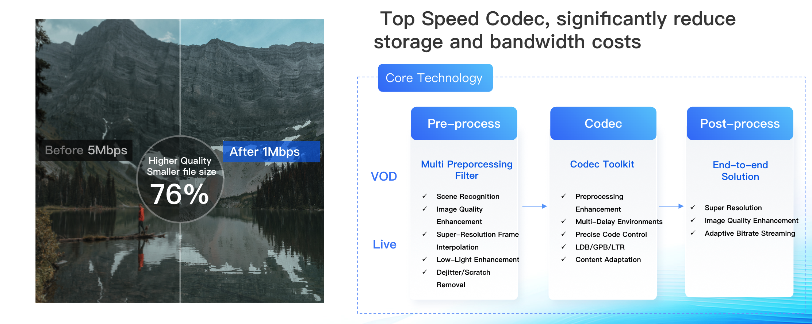
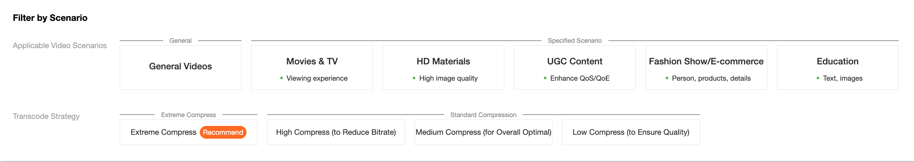
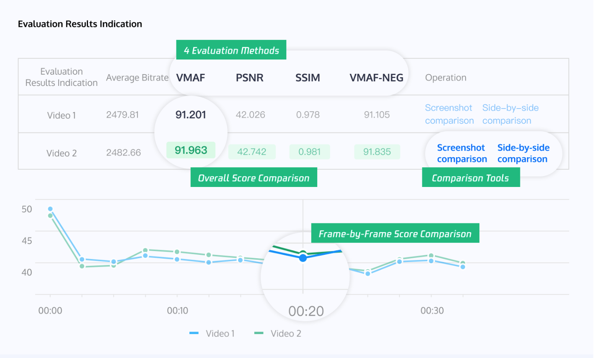

# Сценарий оптимизации затрат на аудио / видео

**Последнее обновление:** 2025-03-21 15:24:03

---

## Обзор

Прямые продажи (live commerce), онлайн-образование, удалённые конференции, короткие видео, короткие драмы и ИИ-контент приводят к стремительному росту объёмов видеоданных.  
Поставщикам сервисов необходимо находить баланс между эффективностью и стоимостью.  
Оптимизация затрат является критически важной для устойчивости и конкурентоспособности.  
Media Processing Service помогает снижать расходы на обработку и хранение аудио- и видеоконтента.

---

## Требования

- Резкий рост видеоконтента увеличил затраты на хранение и передачу данных, что требует технических решений для их снижения.
- Важно сбалансировать количество активированных функций обработки аудио и видео, чтобы избежать как недостаточной оптимизации, так и чрезмерных затрат.
- Дифференциация обработки видео на основе конкретных проблем позволяет максимизировать экономический эффект.

---

## Наши решения

### Передовые возможности кодирования и сжатия

Поддерживаются стандарты кодирования **VP8, VP9, H.264, H.265, AV1, AVS3, H.266**, а также кодирование в реальном времени для **4K и 8K**, обеспечивающее сверхвысокое разрешение и плавное воспроизведение видео.

При сохранении субъективного качества изображения достигается экономия **до 50% пропускной способности**.  
В течение последних трёх лет сервис стабильно занимал первое место в **MSU Video Coding Competition** и показывал лучшие результаты в тестах качества кодирования.

---

## Шаблоны транскодирования

В **консоли Media Processing** доступен широкий набор шаблонов транскодирования аудио и видео.  
Каждый шаблон содержит заранее настроенный набор параметров, что позволяет быстро выбрать подходящий вариант под конкретный бизнес-сценарий.

Также вы можете создавать собственные шаблоны и настраивать параметры вручную.  
Подробности о создании шаблонов и настройке параметров см. в разделе *Audio and Video Transcoding Templates*.  
Информацию о стоимости аудио- и видеотранскодирования можно получить у нашей команды.

---

## Обработка по запросу (On-Demand)

Аудио- и видеосервисы предоставляют высококачественное транскодирование и модель **«Проверка качества + Транскодирование и улучшение»** по запросу.

Для оптимизации затрат:
1. Видео проходит проверку качества перед транскодированием.
2. На основе результатов проверки выбирается подходящий шаблон.
3. Видео без проблем пропускают этап транскодирования, что снижает расходы.

---

## Функциональность

### Проверка качества

| Функция | Описание | Как использовать |
|---|---|---|
| Проверка качества | **Media Quality Inspection поддерживает:**  • Проверку формата (проблемы DTS, PTS, изменение разрешения, частоты дискретизации, потеря кадров, дублирующиеся кадры) • Проверку качества видео и аудио (*JitterResults, BlurResults, AbnormalLightingResults, CrashScreenResults, BlackWhiteEdgeResults, NoiseResults, MosaicResults*) • Оценку качества без эталона (No-reference) | См. документацию **Media Quality Inspection Integration** |

---

### Стратегия транскодирования

| Функция | Описание | Как использовать |
|---|---|---|
| Обычное транскодирование / TSC / адаптивный битрейт | В сценариях обработки по запросу медиаконтент сначала проходит проверку. Видео с проблемами формата или высоким битрейтом транскодируются, а видео без проблем пропускают этот этап, снижая затраты. | См. документацию **ProcessMedia** |

---

## Оценка после транскодирования

После завершения транскодирования результаты можно количественно оценить с помощью встроенных инструментов оценки.

Media Processing поддерживает метрики **VMAF, PSNR, SSIM и VMAF-NEG** для видео из различных источников и форматов.

---

### Возможности оценки

| Категория | Функция | Описание | Как использовать |
|---|---|---|---|
| Видео по запросу | Оценка качества видео | Сравнение оригинального и транскодированного видео. Поддержка VMAF, PSNR, SSIM, VMAF-NEG. Возможность выбора временных интервалов или диапазонов кадров. | См. **User Guide** |
| Видео по запросу | Сравнение BD-Rate | Сравнение качества транскодирования для разных шаблонов и битрейтов. Поддержка VMAF, PSNR, SSIM, VMAF-NEG. Сравнение по заданному битрейту или значению CRF. | См. **User Guide** |
| Прямые трансляции | Качество изображения | Поддержка мониторинга и сравнения качества изображения и битрейта до и после транскодирования live-потока в реальном времени. | Скоро |

---

## Визуализация результатов оценки

