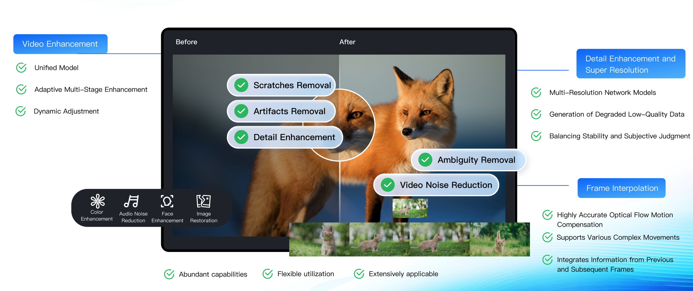

# Сценарий улучшения качества изображения

**Последнее обновление:** 2025-03-21 15:24:37

---

## Обзор

Media Processing от Tencent Cloud повышает качество видео как в VOD, так и в live-стриминге, увеличивая удержание пользователей и коммерческую конверсию.  
Сервис предлагает технические решения для игровых трансляций, шоу талантов, образования и кино, адаптируясь к различным типам контента за счёт технической экспертизы и отраслевого опыта.

---

## Ключевые требования

- Повышение качества видео за счёт устранения визуальных дефектов и обеспечения более высокого уровня просмотра.
- Интеллектуальная обработка по требованию для снижения затрат и повышения эффективности.

---

## Наши решения

### Широкие возможности улучшения аудио и видео

Media Processing предоставляет разнообразные функции улучшения аудио и видео.  
Пользователи могут применять как отдельные функции, так и их комбинации для достижения лучшего результата.

---

## Возможности улучшения

### Улучшение видео

| Тип улучшения | Функция | Описание |
|---|---|---|
| Улучшение видео | Супер-разрешение | Определяет содержимое и контуры видео, восстанавливает детали и локальные особенности в высоком разрешении, преобразуя видео низкого качества в высокое. Подходит для восстановления старых фильмов. |
| Улучшение видео | Улучшение при низкой освещённости | Повышает яркость и контраст в тёмных сценах, вызванных условиями съёмки или ограничениями камеры, улучшая субъективное визуальное восприятие. |
| Улучшение видео | HDR | Поддержка HDR10 и HLG, обеспечивающая более широкий цветовой охват и более насыщенные цвета для видеоконтента высокого качества. |
| Улучшение видео | Комплексное улучшение | Автоматически балансирует текстуру изображения с помощью ИИ, усиливает ключевые детали и устраняет артефакты сжатия и «рваные» края для улучшения общего визуального восприятия. |
| Улучшение видео | Улучшение цвета | Корректирует цветопередачу, приближая её к естественным оттенкам и предпочтениям человеческого зрения. |
| Улучшение видео | Улучшение деталей | Усиливает мелкие детали видео (например, траву на спортивных полях), делая изображение более чётким и насыщенным. |
| Улучшение видео | Улучшение лиц | Усиливает области повышенного зрительного внимания, такие как лица, повышая чёткость и субъективное качество восприятия. |
| Улучшение видео | Удаление царапин | Восстанавливает повреждённый видеоконтент, устраняя царапины и «снежные» артефакты. |
| Улучшение видео | Удаление артефактов | Устраняет блочные искажения, звон, цветовые искажения и «комариный шум», возникающие из-за многократного сжатия при транскодировании. |
| Улучшение видео | Подавление видеошума | Удаляет случайный шум, возникший при съёмке, без потери деталей изображения. |

---

### Улучшение аудио

| Тип улучшения | Функция | Описание |
|---|---|---|
| Улучшение аудио | Подавление шума | Удаляет шумы устройств и окружающей среды; подходит для записи занятий и пост-обработки уличных съёмок. |
| Улучшение аудио | Разделение аудио | Разделяет голос человека и фоновый звук либо вокал и аккомпанемент, обеспечивая гибкую пост-обработку. |
| Улучшение аудио | Выравнивание громкости | **Нормализация громкости:** поддерживает единый уровень громкости. **Выравнивание уровня:** сглаживает слишком громкие участки и предотвращает резкие перепады громкости. |
| Улучшение аудио | Улучшение звука | **Удаление шума:** снижает нежелательные помехи. **De-essing:** подавляет резкие свистящие звуки, возникающие при близком расположении микрофона. |

См. пример ниже:

Консоль Media Processing позволяет создавать и управлять шаблонами улучшения аудио и видео с преднастроенными и настраиваемыми параметрами для различных сценариев, помогая быстро решать бизнес-задачи.

---

## Решения обработки по требованию

Аудио- и видеосервисы предоставляют улучшение и сценарий **Проверка качества + Транскодирование и улучшение** по требованию.  
Такой подход позволяет оптимизировать затраты за счёт предварительной проверки качества видео. На основе результатов проверки выбирается подходящий шаблон улучшения. Эффект оценивается путём сравнения показателей качества до и после обработки.

---

### Функции

| Функция | Описание | Как использовать |
|---|---|---|
| Проверка качества | **Проверка качества включает:**  • **Проверку формата:** выявление проблем DTS, PTS, изменений разрешения, частоты дискретизации, потерь и дублирования кадров.  • **Проверку качества изображения:** обнаружение проблем *JitterResults, BlurResults, AbnormalLightingResults, CrashScreenResults, BlackWhiteEdgeResults, NoiseResults, MosaicResults* и др.  • **Оценку качества без эталона (No-Reference)** | См. документацию **Media Quality Inspection Integration**. |
| Улучшение аудио и видео | В сценариях обработки по требованию выполняется точечное исправление проблем, выявленных при проверке качества:  • Улучшение при низкой освещённости • Комплексное улучшение • Улучшение лиц • Подавление аудиошума  Видео без обнаруженных проблем не обрабатываются, что позволяет снизить затраты. | См. документацию **ProcessMedia**. |
