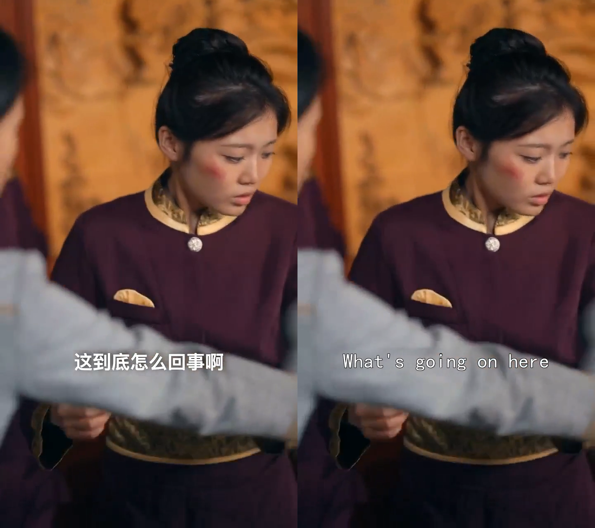

# Сценарий перевода коротких драм

**Последнее обновление:** 2025-03-21 15:25

---

## Обзор

Продукты обработки медиа от Tencent Cloud предоставляют решения для глобального продвижения коротких драм и помогают авторам и продюсерам выводить контент на международные рынки.  
В данном документе описаны функциональные возможности и способы использования сервиса для быстрого достижения интернационализации и локализации коротких драм.


```
Слева: оригинальное видео с китайским текстом и китайской озвучкой;
Справа: сгенерированные многоязычные субтитры и речь после обработки;
Примечание: изображение сгенерировано Tencent Yuanbao AI
```

---

## Требования клиентов коротких драм

При продвижении большого количества видеоконтента возникают следующие сложности:
- неэффективная ручная обработка;
- необходимость автоматического распознавания и генерации многоязычных субтитров;
- удаление или замена элементов внутри видео;
- замена оригинальной языковой дорожки на язык целевого рынка и повторная озвучка для улучшения восприятия.

---

## Наши решения

Короткие драмы, ориентированные на международную аудиторию, остро нуждаются в решениях для перевода субтитров, конвертации озвучки и многоязычной локализации.  
Мы предлагаем комплексное универсальное решение «всё в одном» для перевода и производства коротких драм.


| Функция | Описание |
|---|---|
| Комплексное решение для перевода и производства коротких драм (удаление субтитров + перевод и озвучка + синтез и замена аудио) | Данная функция предоставляет полный цикл обработки: удаление оригинальных субтитров, перевод субтитров и речи, а также замену субтитров и озвучки на другие языки. Обработка входного видео выполняется в следующей последовательности:<br><br>1. Определение субтитров в видеоряде и их удаление.<br>2. Распознавание аудиодорожки оригинального видео с генерацией файлов субтитров и их последующий перевод. Переведённые субтитры затем:<br>&nbsp;&nbsp;2.1. Накладываются на исходные позиции субтитров в видео.<br>&nbsp;&nbsp;2.2. Используются для замены оригинальной аудиодорожки с помощью синтеза речи.<br>3. Формирование нового видеоролика.<br><br>**Пример**<br><br><br><br>Слева: оригинальное китайское короткое видео; справа: обработанное видео с английскими субтитрами и английской озвучкой. |

---

## Отдельные функциональные возможности

Отдельные функции также могут использоваться независимо друг от друга:

| Функция | Описание |
|---|---|
| Удаление водяных знаков, логотипов и субтитров | Удаление водяных знаков, логотипов, субтитров и других элементов из видео, включая размытие и бесшовное удаление. Поддерживается удаление большинства распространённых водяных знаков, а для нестандартных случаев доступно индивидуальное обучение за дополнительную плату. |
| Размытие / мозаика лиц и номерных знаков | Применение эффектов размытия или мозаики к чувствительной информации, такой как лица и номерные знаки, в кадрах видео. |
| Разделение человеческого голоса и фонового звука | Разделение голосовой дорожки и фонового аудио. |
| Распознавание текста | Распознавание текста в видео, включая вертикально ориентированный текст, с автоматическим извлечением ключевых слов. |
| Распознавание речи | Быстрое распознавание речи в видео и преобразование её в текст на основе технологий глубокого обучения. Поддерживается задание пользовательских ключевых слов и определение временных меток их произношения. |
| Перевод субтитров | Перевод оригинальных субтитров с генерацией многоязычных версий для аудитории с различными языковыми предпочтениями. Поддерживается настройка терминологической базы для повышения точности перевода. |
| Встраивание субтитров в видео | Автоматически сгенерированные файлы субтитров встраиваются в видео при транскодировании с возможностью настройки стиля, шрифта, размера, цвета и фона. |
| Преобразование текста в речь | Использование файлов субтитров для создания новых многоязычных аудиофайлов. |
| Замена оригинальной аудиодорожки видео | Замена оригинального звука видео сгенерированным многоязычным аудио для улучшения восприятия локальной аудиторией. |
| Управление цифровыми правами (DRM) | Для защищённого контента поддерживается коммерческий DRM и приватное шифрование HLS. Поддерживаемые форматы DRM: FairPlay и Widevine. |
