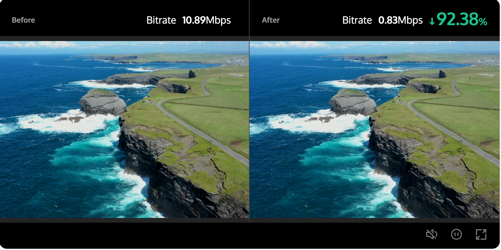
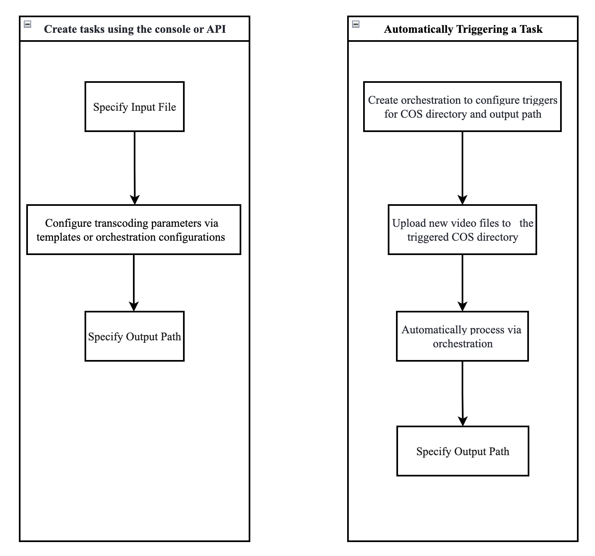
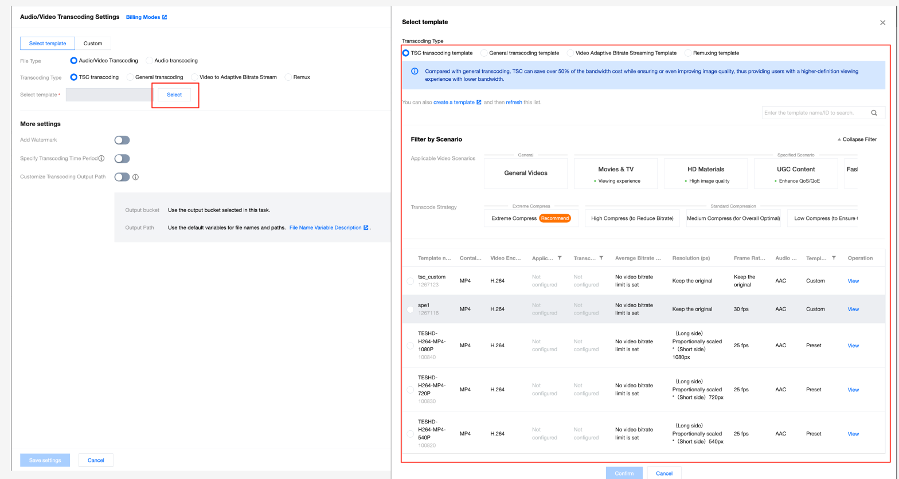
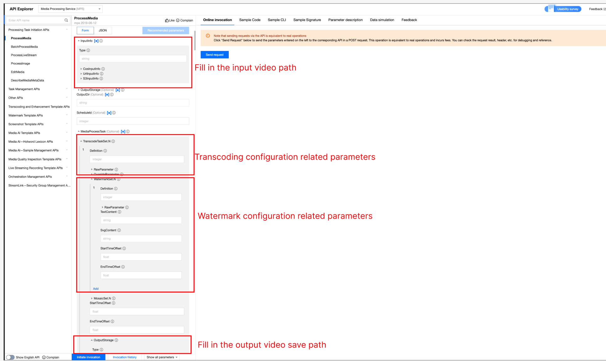
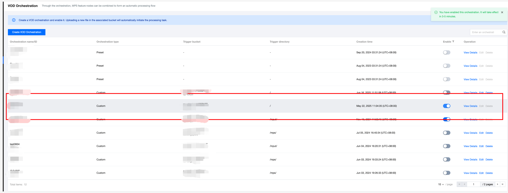
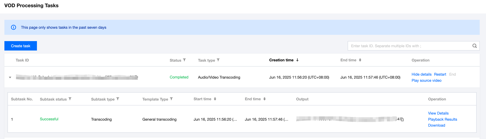
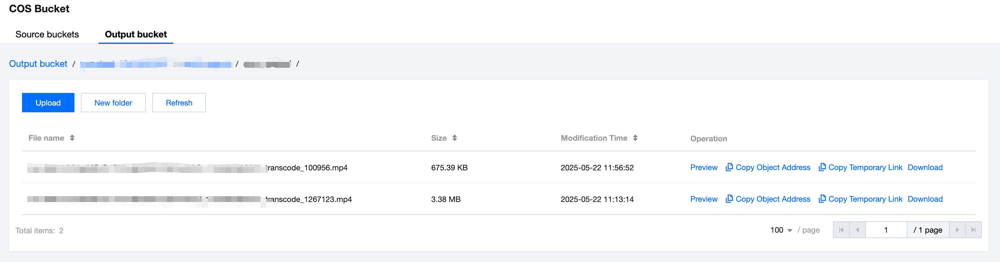
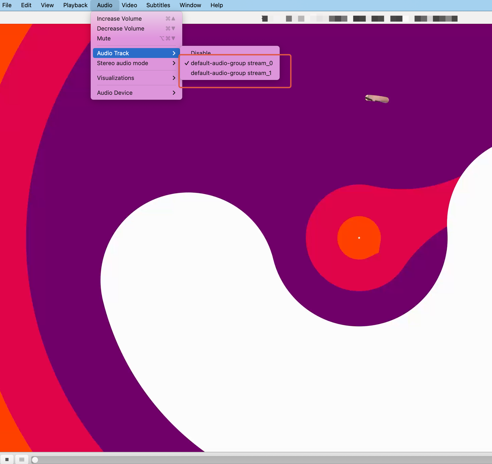

**Последнее обновление:** 2025-11-17 16:27:47

---

## I. Обзор функции транскодирования аудио / видео

### Обзор

Транскодирование аудио/видео — это процесс преобразования исходного аудио- или видеопотока в другой поток с изменёнными параметрами битрейта.  
Это **офлайн-задача**.

В процессе транскодирования можно изменить такие параметры исходного потока, как **формат кодирования**, **разрешение** и **битрейт**, чтобы обеспечить корректное воспроизведение на различных устройствах и в разных сетевых условиях.

Пояснение различных типов транскодирования приведено в таблице ниже.

---

## Типы транскодирования

| Применимый источник | Тип транскодирования | Описание |
|---|---|---|
| Видео | Стандартное транскодирование видео | Снижает битрейт видео и изменяет параметры, такие как стандарт кодирования, разрешение и частота кадров, для адаптации воспроизведения на различных устройствах и в разных сетевых условиях. |
| Видео | TSC-транскодирование | Транскодирование Top Speed Codec (TSC) — это расширенная версия стандартного транскодирования видео. Выполняет адаптивную оптимизацию различных типов видео, обеспечивая более высокое качество изображения при меньшем потреблении пропускной способности. При сохранении или улучшении качества изображения снижает затраты на трафик более чем на 50 %. |
| Видео | Адаптивный битрейт-стриминг (видео) | Преобразует входной видеофайл в несколько потоков с разным битрейтом, подходящих для различных сценариев воспроизведения, позволяя пользователям выбирать оптимальный битрейт в зависимости от сетевых условий. |
| Видео | Remux | Изменяет контейнерный формат исходного видеофайла без перекодирования. |
| Аудио | Стандартное транскодирование аудио | Снижает битрейт аудио и изменяет параметры, такие как стандарт кодирования, частота дискретизации и количество каналов, для адаптации воспроизведения на различных устройствах и в разных сетевых условиях. |
| Аудио | TSC-транскодирование аудио | Расширенная версия стандартного транскодирования аудио. Выполняет адаптивную оптимизацию различных типов аудио, обеспечивая более высокое качество звучания при меньшем потреблении пропускной способности. |
| Аудио | Адаптивный битрейт-стриминг (аудио) | Преобразует входной аудиофайл в несколько потоков с разным битрейтом, адаптируясь к различным сетевым условиям и улучшая пользовательский опыт. |

---

## Технические преимущества

Сервис обработки медиафайлов поддерживает полный набор стандартов кодирования и сжатия аудио и видео и предоставляет несколько методов транскодирования, включая:

- TSC-транскодирование  
- Адаптивный битрейт-стриминг  
- Remux  
- Аудиотранскодирование  

Tencent Cloud MPS поддерживает самый широкий в отрасли набор стандартов кодирования аудио/видео. Благодаря распределённому транскодированию с ускорением до 30+ раз, сервис позволяет значительно сократить потребление пропускной способности и снизить затраты.

## Комплексные методы кодирования — снижение битрейта более чем на 50 %

Поддерживаются различные методы кодирования (VP8, H.264, VP9, H.265, AV1, AVS3, H.266), которые позволяют значительно уменьшить битрейт без потери качества, снижая расходы на трафик и хранение.

---

## Превосходное качество изображения и кристально чёткая картинка

Благодаря интеллектуальной динамической технологии кодирования, TSC обеспечивает более высокое визуальное качество при снижении битрейта. По сравнению с open-source кодировщиками показатель VMAF увеличивается на 3–5 пунктов. Поддерживается кодирование видео с разрешением до 8K в реальном времени, а также интеграция таких технологий, как супер-разрешение, HDR и расширенная цветовая гамма. Кроме того, сервис одним из первых в Китае начал поддерживать Dolby Vision / Dolby Atmos, обеспечивая исключительное качество просмотра.



---

> **Примечание**  
> Откройте **MPS Demo**, чтобы быстро ознакомиться с эффектами функции транскодирования аудио/видео.

---

## Как использовать функцию транскодирования аудио/видео

### (1) Подготовка перед использованием

Перед использованием функции транскодирования необходимо выполнить следующие действия: зарегистрироваться или войти в аккаунт Tencent Cloud, активировать и авторизовать сервис COS. Подробную инструкцию см. в разделе **Getting Started**. Вопросы авторизации аккаунта описаны в разделе **Account Authorization**.

---

### (2) Создание задач транскодирования аудио/видео

Tencent Cloud MPS предоставляет три способа запуска задач: через консоль, через API и с помощью автоматического триггера. Ниже показана общая схема работы для каждого метода.



---

## II. Создание задач транскодирования аудио/видео

### Способ 1. Запуск задачи без кода через консоль

1. Перейдите в консоль **Media Processing Service** и нажмите  
   **Create Task > Create VOD Processing Task**.


2. Укажите входной видеофайл: выберите аудио/видео из COS или AWS S3 либо укажите URL для загрузки.

3. На шаге «Select Input File» добавьте узел **Audio/Video Transcoding**.


4. В окне настроек выберите готовый шаблон транскодирования или задайте собственные параметры. Подробности см. в разделе **Audio/Video Transcoding Template**.



5. Укажите путь хранения выходного файла и нажмите **Create** для запуска задачи.


---

### Способ 2. Запуск задачи через API

**Метод 1:** вызов API **ProcessMedia** с указанием ID шаблона.

```json
{
  "InputInfo": {
    "Type": "URL",
    "UrlInputInfo": {
      "Url": "https://test-1234567.cos.ap-guangzhou.myqcloud.com/video/test.mp4"
    }
  },
  "OutputStorage": {
    "Type": "cos",
    "CosOutputStorage": {
      "Bucket": "test-1234567",
      "Region": "ap-guangzhou"
    }
  },
  "MediaProcessTask": {
    "TranscodeTaskSet": [
      {
        "Definition": 100800
      }
    ]
  }
}

```
* Метод 2: вызов API ProcessMedia с указанием ID оркестрации (ScheduleId).

```json
{
  "InputInfo": {
    "Type": "COS",
    "CosInputInfo": {
      "Bucket": "test-1234567",
      "Region": "ap-guangzhou",
      "Object": "/video/123.mp4"
    }
  },
  "OutputStorage": {
    "Type": "cos",
    "CosOutputStorage": {
      "Bucket": "test-1234567",
      "Region": "ap-guangzhou"
    }
  },
  "ScheduleId": 12345  //Replace it with a custom orchestration ID. 12345 is a sample code and has no practical significance.
}
```

> Рекомендуется использовать API Explorer для отладки и проверки.
>Выберите API ProcessMedia, заполните параметры (входной путь, выходной путь, ID шаблона или оркестрации) и выполните онлайн-вызов.
>
>

---

## Приложение: дополнительные параметры API транскодирования

Некоторые расширенные функции недоступны в консоли. Их можно задать через **API CreateTranscodeTemplate**, передавая параметры в **StdExtInfo**.

---

## Добавление пакетов тишины в аудиопоток

| Параметр | Обязательность | Тип | Описание |
|---|---|---|---|
| enable_mute_audio | Необязательный | Int | При включении добавляются пакеты тишины. Значение по умолчанию — `0`.<br><br>• `0`: Не включать.<br>• `1`: Добавлять пакеты тишины при разрывах аудиофреймов.<br>• `2`: На основе значения `1` дополнительно добавлять пакеты тишины в случае отсутствия аудио в конце. |

**Пример JSON:**
```json
"StdExtInfo" : "{\"audio_info\":{\"enable_mute_audio\":1}}"
```
 ## Метод хранения выходных файлов транскодирования

Консоль поддерживает настройку COS и AWS S3 в качестве путей вывода. Также можно использовать дополнительные параметры для загрузки выходных файлов транскодирования в другие сторонние облачные хранилища.

| Имя параметра | Обязательность | Тип | Описание |
|---|---|---|---|
| appid | Необязательный | String | Идентификатор облачного аккаунта. |
| bucket | Обязательный | String | Имя бакета. |
| region | Обязательный | String | Регион бакета. |
| headers | Необязательный | JSON-структура | JSON-структура, указывающая заголовки, передаваемые при загрузке файлов. Пример:<br><br>`"headers": {`<br>&nbsp;&nbsp;`"agent": "tencent",`<br>&nbsp;&nbsp;`"used": "for-test"`<br>`}` |
| token | Необязательный | String | Загрузка и скачивание с использованием временного токена. |
| id | Необязательный | String | SecretId пользователя. |
| key | Необязательный | String | SecretKey пользователя. |
| host | Необязательный | String | Хост. |
| access_point | Необязательный | String | Требуется для типа `aws_vpc`. |
| storage_type | Необязательный | String | • `aws_s3`: AWS S3.<br>• `aws_vpc`: приватное облако AWS.<br>• `oss`: Alibaba Cloud OSS. |

---

### Пример JSON


```json
{
  "StdExtInfo": "{\"cos_info\":{\"storage_type\":\"oss\",\"bucket\":\"test-test\",\"region\":\"cn-shenzhen\",\"id\":\"abcdefghijk\",\"key\":\"lmnopqrstuvwxyZ\"}}"
}
```


---


### Способ 3. Автоматический запуск задачи MPS после загрузки файла в COS

Если вы хотите загружать видеофайлы в бакет COS и автоматически выполнять транскодирование аудио/видео в соответствии с заранее заданными параметрами, выполните следующие шаги:

1. При создании задачи нажмите **Save the Orchestration** и в появившемся окне настройте параметры, такие как бакет-триггер и каталог-триггер.


2. Затем перейдите в список **VOD Orchestration**, найдите созданную оркестрацию и включите переключатель **Enable**. После этого любые видеофайлы, добавленные в указанный каталог-триггер, будут автоматически запускать задачи в соответствии с заданным процессом и параметрами оркестрации, а обработанные видеофайлы будут сохранены по пути вывода, указанному в оркестрации.

> **Примечание:**  
> После включения оркестрации требуется 3–5 минут, чтобы она вступила в силу.



---

## III. Запрос результатов задач

### 1. Callback-уведомления о задачах

При запуске задачи MPS с использованием **ProcessMedia** вы можете указать параметры callback через `TaskNotifyConfig`. После завершения обработки задачи результат будет отправлен по указанным callback-параметрам. Результаты событийных уведомлений можно разобрать с помощью **ParseNotification**.

### 2. Запрос результатов задач

#### Способ 1: Запрос результатов задачи через API DescribeTaskDetail

Введите `TaskId`, возвращённый API **ProcessMedia** (например, `24000022-WorkflowTask-b20a8exxxxxxx1tt110253`), чтобы получить результаты выполнения задачи.


#### Способ 2: Запрос результатов задачи через консоль

1. Перейдите в консоль **VOD Processing Tasks**, где в списке задач будет отображаться только что запущенная задача.



2. Когда подзадача перейдёт в статус **Successful**, вы можете перейти в **COS Bucket > Output Bucket**, найти путь вывода и просмотреть или скачать файлы, полученные в результате транскодирования аудио/видео.



---

## IV. Инструкции по дополнительным возможностям транскодирования

### Водяные знаки

При создании задачи транскодирования вы можете добавить водяной знак.

- При запуске задачи транскодирования через консоль выполните следующие шаги для добавления водяного знака:


- При запуске задачи с использованием API см. следующий пример:
```json
{
  "InputInfo": {
    "Type": "URL",
    "UrlInputInfo": {
      "Url": "https://test-1234567.cos.ap-guangzhou.myqcloud.com/video/test.mp4" 
      // Замените на URL видеофайла, который требуется обработать
    }
  },
  "OutputStorage": {
    "Type": "cos",
    "CosOutputStorage": {
      "Bucket": "test-1234567",
      "Region": "ap-guangzhou"
    }
  },
  "MediaProcessTask": {
    "TranscodeTaskSet": [
      {
        "Definition": 100800,
        // 100800 — это ID предустановленного шаблона транскодирования видео.
        // Может быть заменён на ID вашего пользовательского шаблона транскодирования аудио/видео.
        "WatermarkSet": [
          {
            "Definition": 12345
            // Замените на ID шаблона водяного знака.
            // 12345 — пример и не имеет практического значения.
          }
        ]
      }
    ]
  }
}
```


# FAQ

## Как добиться более высокого уровня сжатия?
Помимо настройки стандартных параметров кодирования, таких как битрейт и CRF, рекомендуется использовать шаблон экстремального сжатия в TSC (который содержит предустановленные шаблоны для различных сценариев). Это позволяет добиться более высокого уровня сжатия и лучшего качества изображения.

## Как улучшить качество изображения для достижения оптимального результата?
Если предъявляются повышенные требования к качеству изображения, рекомендуется использовать функцию улучшения аудио/видео. Она позволяет значительно повысить качество изображения и включает такие возможности, как комплексное улучшение, улучшение лиц, удаление артефактов, улучшение цвета, супер-разрешение, интеллектуальная интерполяция кадров и использование больших моделей. Подробные инструкции по интеграции см. в **Audio/Video Enhancement Integration Tutorial**.

## Можно ли использовать объектное хранилище других платформ в качестве пути вывода файлов транскодирования?
Да. Путь к объектному хранилищу других платформ можно настроить с помощью дополнительного параметра `StdExtInfo`. Подробнее см. раздел **Appendix: Additional Parameters for Transcoding-Related APIs** выше.

## Поддерживаются ли внешние субтитры?
Да. При использовании адаптивного битрейт-стриминга для видео вы можете указать внешние файлы субтитров через поле `AddOnSubtitles`, чтобы сгенерировать HLS с несколькими битрейтами и субтитрами.  
Чтобы избежать проблем с кодировкой символов, в настоящее время поддерживаются только файлы субтитров в кодировке UTF-8. Допустимые форматы: **SRT**, **WebVTT**, **ASS** и **SSA**.

**Пример JSON для ProcessMedia:**

```json 
{
  "InputInfo": { //Enter video information.
    "Type": "COS",
    "CosInputInfo": {
      "Bucket": "test-1234567",
      "Region": "ap-guangzhou",
      "Object": "/test/subtitleinput/test.mp4"
    }
  },
  "OutputStorage": { //Output bucket.
    "Type": "COS",
    "CosOutputStorage": {
      "Bucket": "cg-1308104797",
      "Region": "ap-guangzhou"
    }
  },
  "OutputDir": "/yunaMPStest/abroutput/", ////Output path.
  "MediaProcessTask": {
    "AdaptiveDynamicStreamingTaskSet": [ //Adaptive bitrate stream configuration.
      {
        "Definition": 1414064, //Adaptive bitrate stream template ID.
        "AddOnSubtitles": [ //External subtitle configuration.
          {
            "Type": "subtitle-stream",
            "Subtitle": {
              "Type": "COS",
              "CosInputInfo": {
                "Bucket": "test-1234567",
                "Region": "ap-guangzhou",
                "Object": "/test/subtitleinput/chs.srt"
              }
            },
            "SubtitleName": "chs"
          },
          {
            "Type": "subtitle-stream",
            "Subtitle": {
              "Type": "COS",
              "CosInputInfo": {
                "Bucket": "test-1234567",
                "Region": "ap-guangzhou",
                "Object": "/test/subtitleinput/cht.srt"
              }
            },
            "SubtitleName": "cht"
          },
          {
            "Type": "subtitle-stream",
            "Subtitle": {
              "Type": "COS",
              "CosInputInfo": {
                "Bucket": "test-1234567",
                "Region": "ap-guangzhou",
                "Object": "/test/subtitleinput/eng.srt"
              }
            },
            "SubtitleName": "eng"
          }
        ]
      }
    ]
  }
}
```
## Многодорожечное входное видео: как сгенерировать отдельные потоки HLS для переключения при воспроизведении

### Сценарий
Если исходное видео содержит несколько аудиодорожек (например, двуязычную озвучку) или несколько видеодорожек (например, ABR HLS-поток), вы можете использовать адаптивный битрейт-стриминг со следующей конфигурацией, чтобы обеспечить плавное переключение между различными аудио- или видеодорожками во время воспроизведения.

### Решение
При создании шаблона **Video Adaptive Bitrate Streaming** и выборе формата вывода **HLS** включите режим **TS + Packed Audio** или **MP4 + Packed Audio** в настройках **Multipart Format**.  
В результате будут сформированы виде файлы (TS или MP4) вместе с отдельными «сырыми» аудиофайлами, что позволит переключаться между разными аудиодорожками при воспроизведении.




---

## Что такое ускоренное транскодирование? Поддерживает ли его сервис?
Ускоренное транскодирование значительно сокращает время обработки видео за счёт разбиения видеофайла на сегменты и параллельного кодирования. Эта функция особенно эффективна при работе со средними и длинными видео. Сервис Media Processing поддерживает ускоренное транскодирование, обеспечивая ускорение более чем в 30 раз. Для включения данной функции необходимо обратиться к нам для активации.

## Обзор биллинга
Сервис транскодирования аудио/видео Tencent Cloud Media Processing (MPS) использует модель биллинга на основе длительности выходного файла. Поддерживаются различные типы обработки, включая стандартное транскодирование, Remux, TSC-транскодирование, транскодирование только аудио и транскодирование в непиковые часы. Полное описание правил биллинга для различных типов обработки см. в разделе [Audio/Video Transcoding Billing](../../pricing.md).
